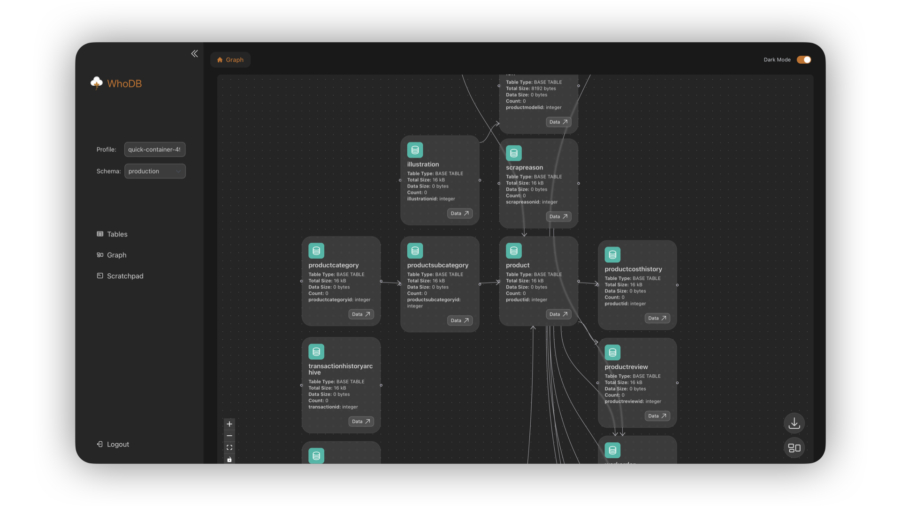
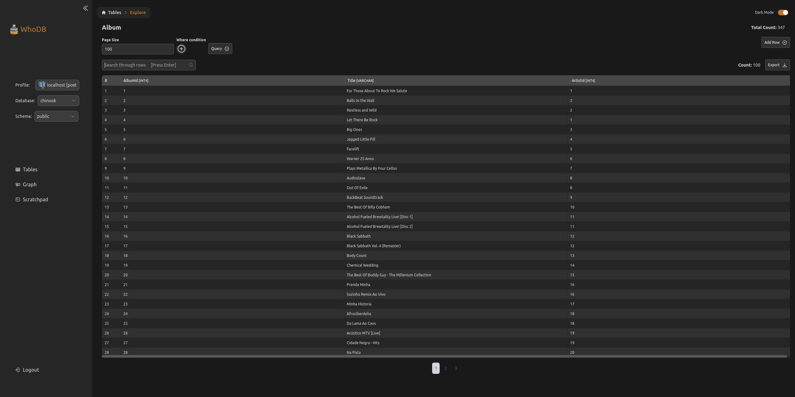
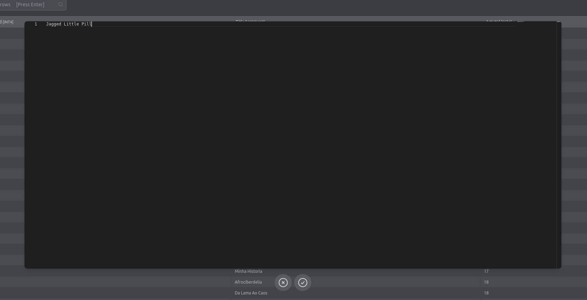
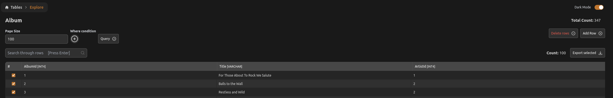
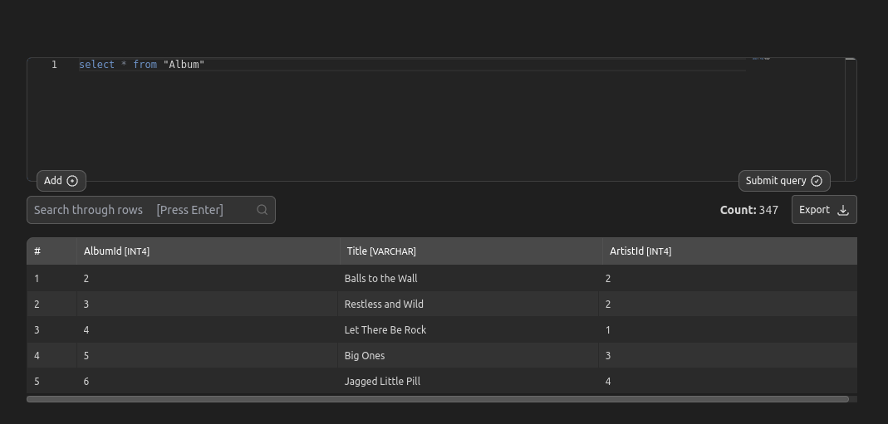
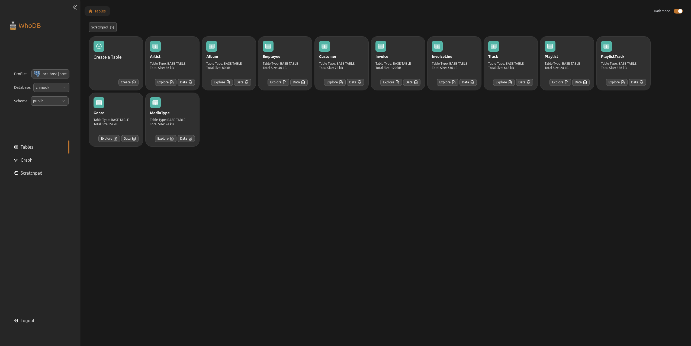

#   WhoDB
Build Status: &nbsp; 

[](https://goreportcard.com/report/github.com/clidey/whodb/core)

### *"Is it magic? Is it sorcery? No, it's just WhoDB!"*
<p align="center"></p>

<details>
    <summary>View screenshots of WhoDB</summary>
    
    
    
    
    
</details>

<div style="width:100%;border-bottom:0.5px solid white;margin:50px 0px;"></div>

#### Table of Contents
1. [Description](#description)
2. [Key Features](#key-features)
3. [Demo](#try-the-demo)
4. [Documentation](#documentation)
5. [Quick Start](#quick-start)
6. [Development Setup](#development-setup)
7. [Frontend](#frontend-setup)
8. [Backend](#backend-setup)
9. [FAQs](#faqs)
10. [Contributing](#contributing)
11. [Infrastructure](#infrastructure)
12. [Contact details](#contact)


## Description
**WhoDB** is a lightweight (<50MB), powerful, and user-friendly database management tool designed to streamline your database administration tasks.
Combining the simplicity of Adminer with enhanced UX and performance, WhoDB is built with GoLang to deliver optimal speed and efficiency.
With features like interactive schema visualization and inline editing, WhoDB caters to both small projects and complex enterprise systems.

**WhoDB offers you the opportunity to talk to your data using natural language thanks to our integration with Ollama, ChatGPT, and Anthropic.
This feature allows you to perform queries and manage your data through conversation instead of complex SQL.**

## Key Features
- **Conversate With Your Data:** No more wasting time crafting complex SQL queries - ask away!
- **Enhanced UX:** A clean, intuitive interface that's easy to navigate.
- **Blazing Fast Performance:** Built with GoLang for exceptional speed, including table virtualization on the frontend.
- **Schema Visualization:** Interactive graphs to easily visualize your database schema.
- **Inline Editing & Preview:** Edit and preview data directly in the interface.
- **Broad Database Support:** Compatible with PostgreSQL, MySQL, SQLite3, MongoDB, Redis, MariaDB, & ElasticSearch. Enterprise supports a lot more NoSQL and SQL-like databases including Oracle, SQL Server, DynamoDB, Athena, Snowflake, and more.
- **Scratchpad:** A Jupyter notebook-like interface for performing database queries.

## Editions

WhoDB is available in two editions:

- **Community Edition (CE)**: Open source with all core features
- **Enterprise Edition (EE)**: Additional database support and advanced features

See [BUILD_AND_RUN.md](./BUILD_AND_RUN.md) for detailed build and run instructions for both editions.

<div style="width:100%;border-bottom:0.5px solid white;margin:50px 0px;"></div>

## Try the demo
Experience WhoDB firsthand with our [live demo](https://whodb.com/demo/login?host=quick-container-491288b0-3138-48fa-93b4-1e730296c0b7.hello.svc.cluster.local&username=user&password=password&database=Adventureworks).  
*Note: This demo is populated with a sample database from postgresDBSamples, with credentials pre-filled.*

Or checkout our [demo video](https://youtu.be/hnAQcYYzcLo)

## Documentation

For more detailed information, check out our [Documentation.](https://whodb.com/docs/)

<div style="width:100%;border-bottom:0.5px solid white;margin:50px 0px;"></div>

## Quick Start

Get up and running with WhoDB quickly using Docker:
```sh
docker run -it -p 8080:8080 clidey/whodb
```

Or, use Docker Compose:
```sh
version: "3.8"
services:
  whodb:
    image: clidey/whodb
    # volumes: # (optional for sqlite) 
    #   - ./sample.db:/db/sample.db
    environment:
#      optional if you have ollama configured elsewhere. will use these defaults otherwise
#      - WHODB_OLLAMA_HOST=localhost
#      - WHODB_OLLAMA_PORT=11434

#      use this to preconfigure your Anthropic connection. endpoint will default to below
      - WHODB_ANTHROPIC_API_KEY=...
#      - WHODB_ANTHROPIC_ENDPOINT=https://api.anthropic.com/v1

#     use this to preconfigure your OpenAI connection. endpoint will default to below
      - WHODB_OPENAI_API_KEY=...
#      - WHODB_OPENAI_ENDPOINT=https://api.openai.com/v1
    ports:
      - "8080:8080"
```

Access WhoDB by navigating to http://localhost:8080 in your browser.

<div style="width:100%;border-bottom:0.5px solid white;margin:20px 0px;"></div>

## Development Setup
### Prerequisites
- GoLang (latest version recommended)
- PNPM (latest version recommended)

### Editions

WhoDB is available in two editions:
- **Community Edition (CE)**: Core features with support for PostgreSQL, MySQL, SQLite3, MongoDB, Redis, MariaDB, & ElasticSearch
- **Enterprise Edition (EE)**: All CE features plus additional database support, advanced visualizations, and enhanced UI components

See [BUILD_AND_RUN.md](./BUILD_AND_RUN.md) for detailed build and run instructions and [ARCHITECTURE.md](./ARCHITECTURE.md) for understanding the modular design.

### Frontend Setup
To start the frontend service, navigate to the `frontend/` directory and run:
```sh
pnpm i && pnpm start
```

### Backend Setup
##### 1. Preparing the Frontend for the Backend (Only if you don’t have a build/ directory in core/):
If the `core/` directory doesn't have a `build/` folder, you'll need to build the frontend and move it to the backend directory. From the root directory, run:
```sh
cd frontend && pnpm install && pnpm run build && rm -rf ../core/build/ && cp -r ./build ../core/ && cd -;
```
This command will compile the frontend and copy the `build/` folder to `core/`. 
This step is required because Go will attempt to embed the `build/` folder on each launch. 
You only need to do this once.

##### 2. Setting up Ollama (if you'd like to enable the natural conversation integration)
Go to https://ollama.com/ and download it for your system. 
Once that is done, we recommend that you start out with the [Llama 3.1 8b model](https://ollama.com/library/llama3.1).
WhoDB will automatically detect your installed model(s) and will show you a **Chat** option on the left sidebar.

##### 3. Starting the Backend Service
If the `core/` directory already has a `build/` folder, or once you've completed the step above, you can start the backend service by running:
```sh
cd core/
go run .
```

<div style="width:100%;border-bottom:0.5px solid white;margin:50px 0px;"></div>

## FAQs

**What inspired the creation of WhoDB?**  
WhoDB was inspired by Adminer for its lightweight nature and ease of use. We aimed to build on these qualities with enhanced visualization and a consistent user experience across various databases.

**How does WhoDB handle large queries?**  
WhoDB supports lazy loading, ensuring smooth performance even with large datasets.

**What makes WhoDB different from DBeaver?**  
Unlike DBeaver, which is feature-rich but resource-heavy, WhoDB is designed to be lightweight and efficient, running on minimal resources—perfect for smaller setups or resource-constrained environments.

**Is WhoDB compatible with any database?**
WhoDB supports a wide range of databases, providing a consistent experience across SQL, NoSQL, and Graph databases. The Community Edition supports PostgreSQL, MySQL, SQLite3, MongoDB, Redis, MariaDB, & ElasticSearch. The Enterprise Edition adds support for additional databases.

**How do I deploy WhoDB?**
WhoDB can be deployed easily using Docker or Docker Compose. See the ["Quick Start"](#quick-start) section for details.

**Q: Is WhoDB suitable for production environments?**  
While WhoDB is lightweight and efficient, we recommend evaluating its suitability for your specific production environment.

## Contributing

We welcome contributions from the community! Feel free to open issues or submit pull requests to help improve WhoDB. 
We have a contribution guide [here](https://github.com/clidey/whodb/blob/main/CONTRIBUTING.md).

## Infrastructure

WhoDB's deployment and CI/CD are managed by Clidey, a no-code DevOps platform. For more information, visit https://clidey.com

Clidey Build Status: &nbsp; 

## Contact

For any inquiries or support, please reach out to [support@clidey.com](mailto:support@clidey.com).


*"Is it magic? Is it sorcery? No, it's just WhoDB!"*
