<div align="center">

#   WhoDB

### *Where data access meets operational intelligence*

<!-- [](https://clidey.com) -->


[//]: # ([![E2E Tests]&#40;https://github.com/clidey/whodb/actions/workflows/e2e-ce.yml/badge.svg&#41;]&#40;https://github.com/clidey/whodb/actions/workflows/e2e-ce.yml&#41;)


[](LICENSE)
[](https://github.com/clidey/whodb/stargazers)


[](https://goreportcard.com/report/github.com/clidey/whodb/core)

## Available on

[](https://hub.docker.com/repository/docker/clidey/whodb)
[](https://apps.microsoft.com/detail/9pftx5bv4ds6)
[](https://apps.apple.com/app/whodb/id6754566536)
[](http://snapcraft.io/whodb)
[](./cli/README.md)

[Quick Start](#quick-start) • [Documentation](https://docs.whodb.com/) • [Live Demo](https://demo.whodb.com/login?host=quick-container-491288b0-3138-48fa-93b4-1e730296c0b7.hello.svc.cluster.local&username=user&password=password&database=Adventureworks) • [Community](https://github.com/clidey/whodb/discussions)

</div>

---

<p align="center">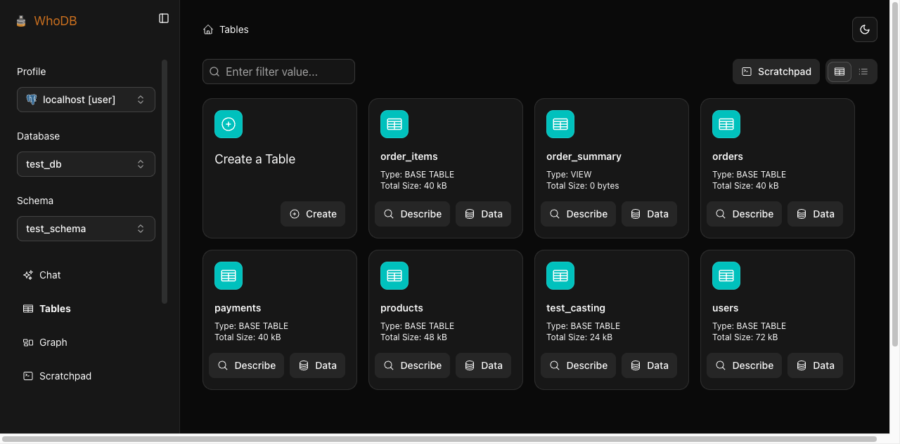</p>

## What is WhoDB?

**WhoDB Community is the open-source data workspace. WhoDB Platform is the AI data platform for teams that need governed access, pipelines, and operational intelligence across every system they run.**

Start with WhoDB Community when you need a fast, lightweight way to connect to a database, understand its shape, and query it without a heavy desktop client. Move to WhoDB Platform when your team needs more than a better SQL editor — when the question is no longer "how do I query this data" but "which customer is blocked, which account is at risk, which deploy broke something, and what should we do about it."

Built in Go and React, WhoDB starts in under a second, ships under 100MB, and uses around 90% less memory than tools like DBeaver or DataGrip. Just run `docker run -it -p 8080:8080 clidey/whodb` and you're in.

For local AI: connect Ollama and type questions in plain English. For enterprise governance: AES-256-GCM credential storage, SSO through Okta/Azure AD/Google Workspace, access controls down to the data-view level, and a complete audit trail, all on your own servers.

---

## Key Features

### Data grid and schema explorer

<table>
<tr>
<td width="50%">
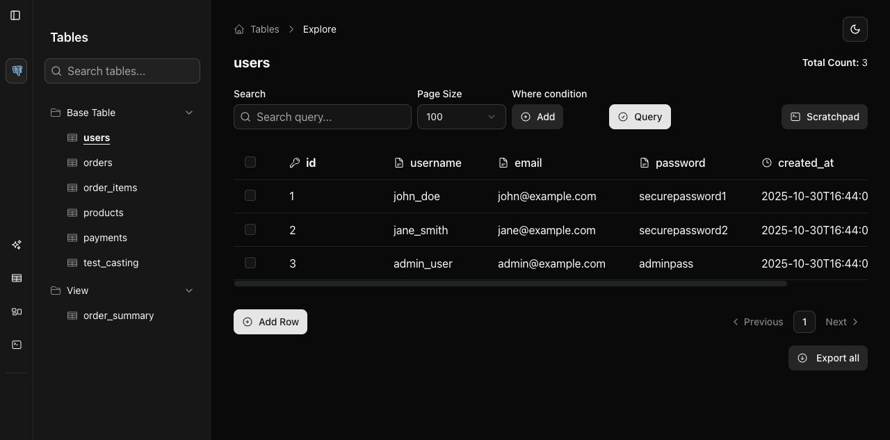
</td>
<td width="50%">

A spreadsheet-style grid for browsing and editing rows. Sort, filter, inline-edit, bulk-delete. The schema graph follows foreign keys visually so you can see how tables relate without reading `INFORMATION_SCHEMA`.

</td>
</tr>
</table>

<table>
<tr>
<td width="50%">

Click any node in the schema graph to pan and zoom to that table. Foreign key relationships render as edges, so tracing a join path is a visual operation rather than a mental one.

</td>
<td width="50%">
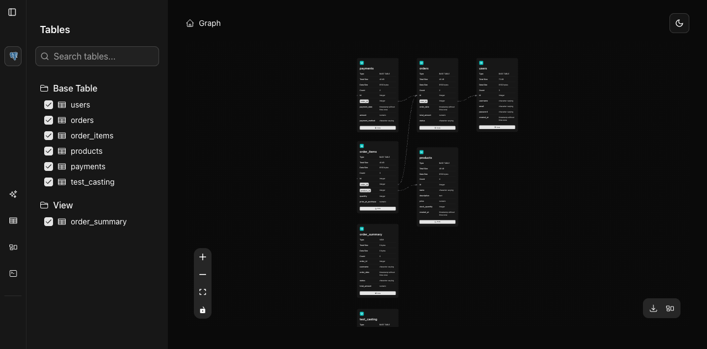
</td>
</tr>
</table>

### Query Scratchpad

<table>
<tr>
<td width="50%">
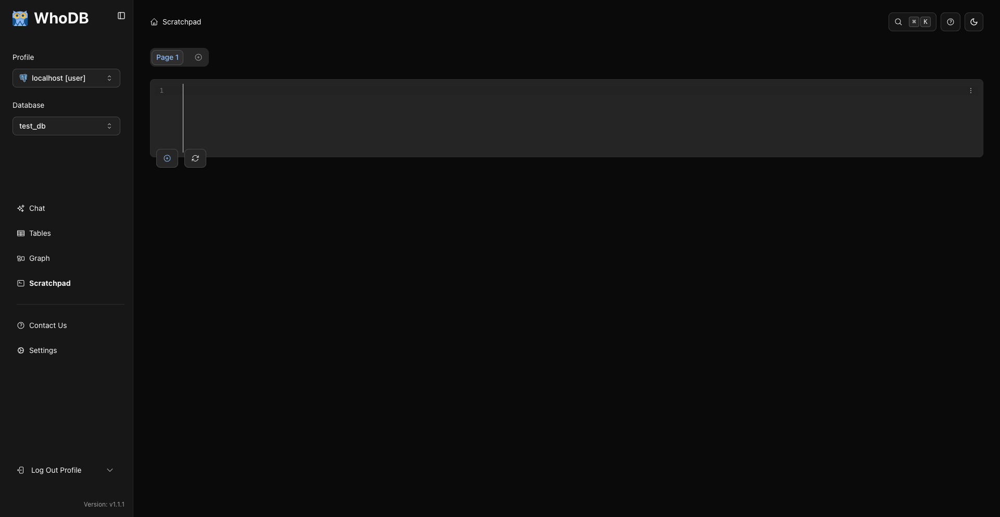
</td>
<td width="50%">

A Jupyter-style multi-cell query editor with syntax highlighting, autocomplete, and history. Run one cell at a time or the whole notebook. Results stay visible below each cell.

</td>
</tr>
</table>

### More

- Mock data generation for development and testing
- Export to CSV, Excel, JSON, or SQL
- Visual WHERE condition builder (no SQL required)
- Natural language to SQL via Ollama, OpenAI, Anthropic, or any OpenAI-compatible provider
- Visual pipeline builder with 12 step types and cross-system joins (WhoDB Platform)
- Centralized file management for exports and reports, with version history and access controls (WhoDB Platform)

### Supported databases

**WhoDB Community:** PostgreSQL, MySQL, SQLite3, MongoDB, Redis, MariaDB, ElasticSearch, ClickHouse, CockroachDB, DuckDB, Memcached, TiDB, Valkey, Dragonfly, OpenSearch, YugabyteDB, QuestDB, FerretDB

**WhoDB Platform:** All Community databases plus Oracle, SQL Server, DynamoDB, Athena, Snowflake, Cassandra, TallyPrime, PostHog, Google Analytics, ElastiCache, DocumentDB, Azure Data Lake Storage, Azure Blob, Azure Files, Azure Cosmos DB, Dynamics 365 Business Central, AWS S3, GCS, IBM DB2, Trino, Databricks, Neo4j, Memgraph, GaussDB, StarRocks, SAP HANA, BigQuery, Spanner, Redshift, Aurora, MemoryDB, SingleStore, Firestore, and more

---

## WhoDB Platform

WhoDB Community is the sharp wedge: connect to your data quickly, understand it visually, and query it without fighting a heavy desktop client. WhoDB Platform turns that foundation into a layer for faster decisions across the company.

The platform is built around six things:

- **All sources:** bring operational systems into one governed data layer
- **ETLs:** move and shape data so teams and AI agents can use it reliably
- **Ontology:** map raw tables, collections, and events into business objects — customers, accounts, orders, tickets, incidents, invoices, workflows
- **Governance:** control who can see, query, change, and act on data
- **Apps:** build internal operational tools on top of shared source context
- **WhoDB AI Agent:** ask questions and take action across sources with the right context and permissions

The point is not to make people write SQL faster. The point is to help teams reach decisions faster:

- Which customer is blocked and why?
- Which account is at risk this week?
- Which workflow failed?
- Which deploy affected paying users?
- Which support tickets need engineering context?
- What should the team do next?

It is Palantir-like operational intelligence without the enterprise lock-in. Runs on your infrastructure; pricing is per deployment, not per seat.

### Data Integration

Register a database once; every team gets a scoped view of it. Finance sees financial data, marketing sees campaign data. The relationship map shows at a glance how everything connects. Credentials are encrypted with AES-256-GCM and stored centrally, decrypted only at the moment of use, never in plain text, never shared across teams.

### Pipeline Automation

Visual pipeline builder with 12 step types and cross-system joins. Runs on a schedule or reacts to events. Built for scale — the processing engine handles enterprise data volumes and recovers automatically from failures without data loss.

### Live Reporting and Dashboards

Pull from multiple systems into a single report without exports or spreadsheet joins. Dashboards update in real time. Describe what you want to the AI assistant and get a working dashboard back. Automated report delivery runs on a schedule: daily revenue summaries, weekly KPI packs, monthly board decks.

### Data Catalog and Ontology

A shared data dictionary your whole org works from. Map relationships between entities. Trace any number in a report back to the source row that produced it. If a figure looks wrong, you find the root cause in seconds rather than hours.

### Security and Governance

- AES-256-GCM credential encryption, decrypted only at the moment of use
- Data classification labels (PII, Confidential, Restricted, Internal, or custom); access blocked automatically for anyone without the right clearance
- Data quality rules that reject bad data before it reaches reports
- Full audit trail: every access, execution, permission change, and login recorded with context
- SSO via Okta, Azure AD, Google Workspace, Auth0
- Authorization at workspace, project, data view, and classification level
- Read-only source access; WhoDB never writes to your source systems
- Air-gapped and isolated deployment supported

### Internal App Builder

Describe what you need and the AI builds a working dashboard, tracker, or tool. Access controls and data classification are enforced on every app from the start. Share with your team without a deployment process or IT ticket.

### Pricing

| Plan | Price | Best for |
|---|---|---|
| **Community** | Free, forever | Developers and small teams (production-ready, no restrictions) |
| **Starter** | $20/mo per deployment | Small teams needing SSO and basic governance |
| **Team** | $50/mo per deployment | Growing teams that need classification, quality rules, and cross-system reporting |
| **Enterprise** | Custom per deployment | Unlimited scale, full governance, air-gapped deployment, compliance documentation |

No per-seat pricing on any plan. Full pricing at [whodb.com/pricing](https://whodb.com/pricing/) · [Request a demo](https://whodb.com/platform/)

### Who uses WhoDB Platform

Common in industries where the data can't leave the building:

- **Financial services:** trading, risk management, and regulatory reporting from one governed platform
- **Healthcare:** patient data stays on-premises with a full audit trail for compliance reviews
- **Government and defense:** isolated deployments with complete data sovereignty
- **Manufacturing:** sensor data to executive dashboards, with full data lineage
- **Retail and e-commerce:** customer 360 without sending data to a third-party cloud
- **Telecom:** network and business data at scale

---

## Try it

<div align="center">

<table>
<tr>
<td align="center" width="50%">
<h3>Live Demo</h3>
<p>Pre-filled with a sample PostgreSQL database</p>
<a href="https://whodb.com/demo/login?host=quick-container-491288b0-3138-48fa-93b4-1e730296c0b7.hello.svc.cluster.local&username=user&password=password&database=Adventureworks">
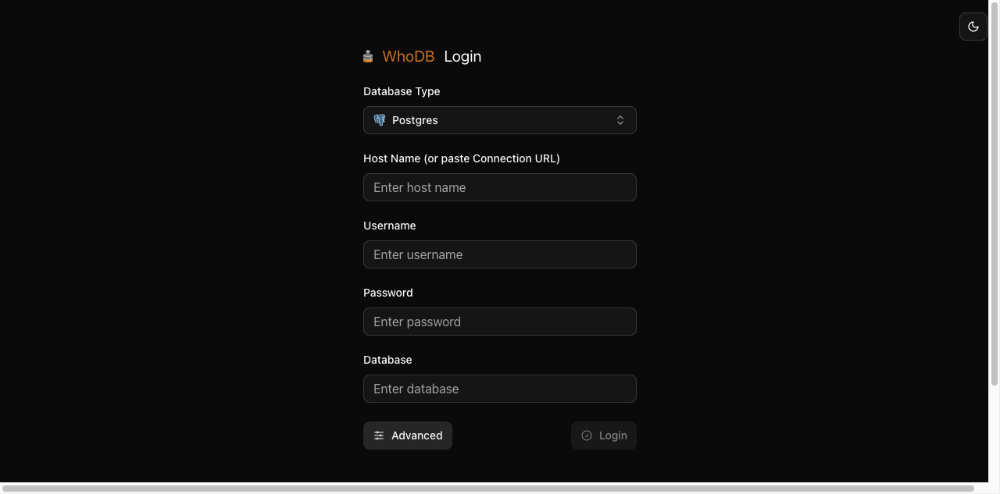
</a>
<p><a href="https://whodb.com/demo/login?host=quick-container-491288b0-3138-48fa-93b4-1e730296c0b7.hello.svc.cluster.local&username=user&password=password&database=Adventureworks"><strong>Launch Demo →</strong></a></p>
</td>
<td align="center" width="50%">
<h3>Video walkthrough</h3>
<p>Full feature walkthrough</p>
<a href="https://youtu.be/hnAQcYYzcLo">

</a>
<p><a href="https://youtu.be/hnAQcYYzcLo"><strong>Watch →</strong></a></p>
</td>
</tr>
</table>

</div>

---

## Quick Start

### Docker

```bash
docker run -it -p 8080:8080 clidey/whodb
```

Open [http://localhost:8080](http://localhost:8080) and connect a database.

WhoDB keeps your login sessions server-side (credentials are encrypted at rest, not stored in the browser). The plain command above works out of the box; sessions reset on container recreation (you simply log in again). To keep sessions across upgrades, mount a volume and set an encryption key:

```bash
docker run -it -p 8080:8080 \
  -v whodb-data:/data \
  -e WHODB_ENCRYPTION_KEY=$(openssl rand -hex 32) \
  clidey/whodb
```

Running behind an HTTPS reverse proxy (nginx, Traefik, Caddy, a cloud load balancer, etc.)? Also set `WHODB_SECURE=true` so the session cookie is marked `Secure`. WhoDB does not infer HTTPS from proxy headers, so this must be set explicitly. Leave it unset for plain HTTP (including `localhost`), otherwise the browser will drop the cookie and logins won't persist.

### Docker Compose

```yaml
version: "3.8"
services:
  whodb:
    image: clidey/whodb
    ports:
      - "8080:8080"
    volumes:
      # Persist encrypted login sessions across container recreation
      - whodb-data:/data
    environment:
      # Encryption key for stored sessions (64-char hex). Generate once with:
      #   openssl rand -hex 32
      # Setting it keeps sessions valid across upgrades regardless of the volume.
      - WHODB_ENCRYPTION_KEY=replace_with_openssl_rand_hex_32

      # Uncomment when serving over HTTPS (e.g. behind a TLS-terminating proxy)
      # so the session cookie is marked Secure. Leave unset for plain HTTP.
      # - WHODB_SECURE=true

      # Ollama (local AI)
      - WHODB_OLLAMA_HOST=localhost
      - WHODB_OLLAMA_PORT=11434

      # Anthropic
      - WHODB_ANTHROPIC_API_KEY=your_key_here
      # - WHODB_ANTHROPIC_ENDPOINT=https://api.anthropic.com/v1

      # OpenAI
      - WHODB_OPENAI_API_KEY=your_key_here
      # - WHODB_OPENAI_ENDPOINT=https://api.openai.com/v1

      # Any OpenAI-compatible provider (LM Studio, OpenRouter, Requesty, etc.)
      # - WHODB_AI_GENERIC_LMSTUDIO_NAME=LM Studio
      # - WHODB_AI_GENERIC_LMSTUDIO_BASE_URL=http://host.docker.internal:1234/v1
      # - WHODB_AI_GENERIC_LMSTUDIO_MODELS=mistral-7b,llama-3-8b
      #
      # - WHODB_AI_GENERIC_OPENROUTER_NAME=OpenRouter
      # - WHODB_AI_GENERIC_OPENROUTER_BASE_URL=https://openrouter.ai/api/v1
      # - WHODB_AI_GENERIC_OPENROUTER_API_KEY=your_key_here
      # - WHODB_AI_GENERIC_OPENROUTER_MODELS=google/gemini-2.0-flash-001,anthropic/claude-3.5-sonnet
    # volumes:
    #   - ./sample.db:/db/sample.db

volumes:
  whodb-data:
```

📖 For full installation and configuration options, see the [Documentation](https://docs.whodb.com/)

---

## CLI

The CLI has an interactive TUI for browsing databases in the terminal, and an MCP server mode for Claude, Cursor, and other AI tools. Runs on macOS, Linux, and Windows.

```bash
# macOS/Linux
curl -fsSL https://raw.githubusercontent.com/clidey/whodb/main/cli/install/install.sh | bash

# npm
npm install -g @clidey/whodb-cli
```

```bash
whodb-cli              # launch TUI
whodb-cli mcp serve    # run as MCP server
```

📖 See the [CLI README](./cli/README.md) for full usage.

---

## Development Setup

### Prerequisites

- **GoLang** (latest)
- **PNPM** and **Node.js 16+** (frontend)

### Editions

<table>
<tr>
<td width="50%">

**WhoDB Community**
- PostgreSQL
- MySQL / MariaDB
- SQLite3
- MongoDB
- Redis
- ElasticSearch

</td>
<td width="50%">

**WhoDB Platform**
- All Community databases
- Oracle, SQL Server, Snowflake
- DynamoDB, Athena, Redshift
- Cassandra, Neo4j, Databricks
- 50+ total connectors

</td>
</tr>
</table>

📚 See [BUILD_AND_RUN.md](./BUILD_AND_RUN.md) for build instructions.

### Frontend

```bash
cd frontend
pnpm i
pnpm start
```

### Backend

If `core/build/` doesn't exist yet, build the frontend first (Go embeds it at compile time):

```bash
cd frontend && pnpm install && pnpm run build
rm -rf ../core/build/ && cp -r ./build ../core/
cd ..
```

To enable natural language queries, set up an AI provider:

1. **Ollama:** Download from [ollama.com](https://ollama.com/), then `ollama pull llama3.1`. WhoDB auto-detects installed models and adds a Chat option in the sidebar.
2. **OpenAI/Anthropic:** Set environment variables (see Docker Compose above)
3. **Any OpenAI-compatible provider:** Use `WHODB_AI_GENERIC_<ID>_*` env vars (LM Studio, OpenRouter, Requesty, vLLM, etc.)

Then start the backend:

```bash
cd core
go run ./cmd/whodb
# starts on http://localhost:8080
```

---

## Use Cases

### Developers

Good for local development — spin it up against a dev database, browse schema, run queries, generate mock data. Also works well for debugging production issues when you want a read-only view without installing anything heavy.

**Local development:** quick schema inspection, explore changes after a migration, test query performance against real data

**API development:** validate data transformations, generate mock data for integration tests, export fixtures

### Data analysts and operations teams

- Query across CRM, payments, warehouses, and 20+ systems from one interface
- Build automated reports visually without writing code or filing an engineering ticket
- Replace emailed spreadsheets with live dashboards
- Ask questions in plain English using the AI assistant

### QA engineers

Verify database state during test runs, generate realistic seed data, validate migrations. The read-only mode means there's no risk of accidentally mutating production data.

### Database administrators

Browse table structures, inspect indexes, manage user data, and run ad-hoc queries without a full desktop client install. The schema graph is useful when onboarding to an unfamiliar database.

### Compliance and security teams

- Full audit trail of every access, execution, and permission change
- Data classification with automatic enforcement: set a label, access is blocked for anyone without clearance
- Pull a compliance report in minutes rather than spending weeks chasing logs
- SSO with Okta, Azure AD, Google Workspace, Auth0

### Teams outgrowing a database viewer

WhoDB Community handles most of what individual developers and small teams need. The signal that it's time to look at WhoDB Platform is usually one of these: you're running data across more than two or three systems and joining them manually in spreadsheets, your data team is a bottleneck for every report, or someone in the company asked "why did that happen" and it took a week to find out. That's the problem WhoDB Platform is built to close.

---

## FAQ

<details>
<summary><strong>How does WhoDB compare to DBeaver, TablePlus, or DataGrip?</strong></summary>
<br>

WhoDB is lighter (under 100MB, starts in under a second) and self-hosted via Docker, so it works well in environments where you don't want a desktop client installed on every machine. It doesn't have the query plan visualization or advanced debugger that DataGrip has, but it adds things those tools don't: AI-powered SQL, a schema graph, mock data generation, and — in WhoDB Platform — pipelines, dashboards, and access governance.

If you need a full-featured desktop SQL IDE, DataGrip is hard to beat. If you need something fast, self-hosted, and browser-accessible that your whole team can use without per-seat licensing, WhoDB fits better.

</details>

<details>
<summary><strong>How do I connect WhoDB to PostgreSQL / MySQL / MongoDB?</strong></summary>
<br>

Run the Docker container, open `http://localhost:8080`, and fill in the connection form. Host, port, username, password, and database name — same fields as any other client. For SSL connections, see the [documentation](https://docs.whodb.com/).

For persistent connections across restarts, use the Docker Compose setup and optionally configure connection profiles in the UI.

</details>

<details>
<summary><strong>Can I use WhoDB with a local AI model (Ollama, LM Studio)?</strong></summary>
<br>

Yes. For Ollama, install it locally, pull a model (`ollama pull llama3.1`), then set `WHODB_OLLAMA_HOST` and `WHODB_OLLAMA_PORT` when running WhoDB. It auto-detects installed models and adds a Chat option in the sidebar.

For LM Studio or any other OpenAI-compatible endpoint, use the `WHODB_AI_GENERIC_<ID>_*` env vars:

```
WHODB_AI_GENERIC_LMSTUDIO_NAME=LM Studio
WHODB_AI_GENERIC_LMSTUDIO_BASE_URL=http://host.docker.internal:1234/v1
WHODB_AI_GENERIC_LMSTUDIO_MODELS=mistral-7b
```

Your data never leaves your network regardless of which provider you use.

</details>

<details>
<summary><strong>Does WhoDB work with OpenAI or Anthropic?</strong></summary>
<br>

Yes — set `WHODB_OPENAI_API_KEY` or `WHODB_ANTHROPIC_API_KEY` and the corresponding models become available in the Chat sidebar. You can also use OpenRouter, Requesty, Azure OpenAI, or any endpoint that speaks the OpenAI API format.

</details>

<details>
<summary><strong>Is WhoDB suitable for production use?</strong></summary>
<br>

It's in production at a range of companies. For sensitive environments, we'd suggest a read-only database account where possible and SSL/TLS on the connection. Audit logging and access controls are in WhoDB Platform if you need them.

</details>

<details>
<summary><strong>How does WhoDB handle large tables?</strong></summary>
<br>

The grid uses virtual rendering, so scrolling through large result sets doesn't lock up the browser. Results are paginated and streamed rather than loaded all at once. For very large exports, WhoDB Platform adds scheduled report generation so you're not doing it interactively.

</details>

<details>
<summary><strong>Does WhoDB store my database credentials?</strong></summary>
<br>

In WhoDB Community, connections are session-scoped and cleared when you close the browser. You can optionally save connection profiles in local browser storage — nothing leaves your machine.

In WhoDB Platform, credentials are encrypted with AES-256-GCM and stored centrally, decrypted only at the moment of use. No plain text storage, no shared passwords across teams.

</details>

<details>
<summary><strong>Can I self-host WhoDB in an air-gapped environment?</strong></summary>
<br>

WhoDB Community runs in any environment including air-gapped networks — there's no license server, and it works fully offline. By default it sends one anonymous daily heartbeat (a random install identifier plus edition, version, and OS — no IP, no usage data, nothing tied to you or your machine) so we know how many installs exist and stay active; set `WHODB_HEARTBEAT_DISABLED=true` to turn it off, or delete the config file to reset the identifier. All behavioral analytics is separate and opt-in. WhoDB Platform supports fully isolated deployments with offline activation.

</details>

<details>
<summary><strong>What is the difference between WhoDB Community and WhoDB Platform?</strong></summary>
<br>

WhoDB Community is free and open-source. It covers database browsing, schema visualization, the Scratchpad query editor, mock data generation, exports, and AI-powered SQL via any provider you connect. No usage limits.

WhoDB Platform adds the full platform layer: visual pipelines, live dashboards, cross-system reporting, an AI app builder, a data catalog with lineage, data classification and quality rules, a complete audit trail, SSO, granular authorization, air-gapped deployment, and 50+ connectors including Oracle, SQL Server, Snowflake, Athena, and Cassandra.

See [whodb.com/pricing](https://whodb.com/pricing/) for the full breakdown.

</details>

<details>
<summary><strong>Why is WhoDB open-core instead of fully open source?</strong></summary>
<br>

WhoDB Community is not a toy demo or a restricted trial — it's a real source exploration and query workspace that developers can run in production today.

The full platform value comes when sources, ETLs, ontology, governance, apps, and the WhoDB AI Agent work together. That's where teams move from data access to faster decisions. As more parts become complete standalone value for the community, we plan to open-source more of them.

</details>

<details>
<summary><strong>Does my data ever leave my network?</strong></summary>
<br>

No. WhoDB runs on your infrastructure. On paid plans, only the license key communicates externally. Your data, queries, reports, and credentials stay on your servers. WhoDB never writes to your source systems — any outputs (exports, reports) go to separate governed storage.

</details>

<details>
<summary><strong>Is there a no-per-seat pricing option?</strong></summary>
<br>

All plans are priced per deployment, not per seat. Add as many team members as you need without cost increasing. The Enterprise plan has no team size cap.

</details>

---

## Contributing

Bug reports, feature requests, and PRs are welcome.

1. **Found a bug?** [Open an issue](https://github.com/clidey/whodb/issues)
2. **Have an idea?** [Start a discussion](https://github.com/clidey/whodb/discussions)
3. **Want to contribute code?** Check the [Contributing Guide](CONTRIBUTING.md) first
4. **Documentation PRs** are especially appreciated

---

## Screenshots

<details>
<summary>View screenshots</summary>

### Data grid


### Add / edit records
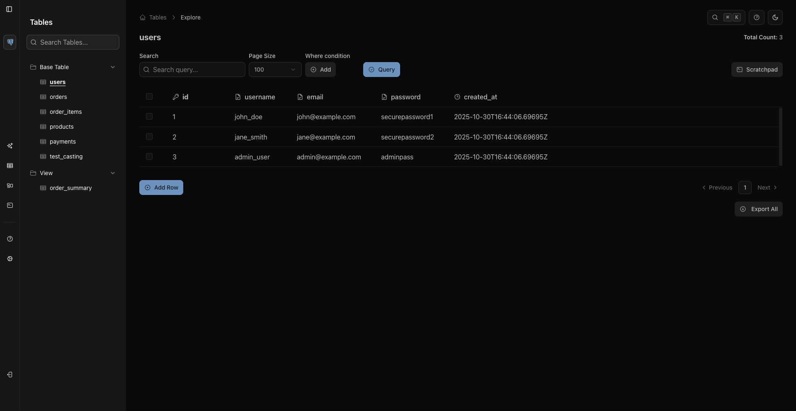

### WHERE condition builder
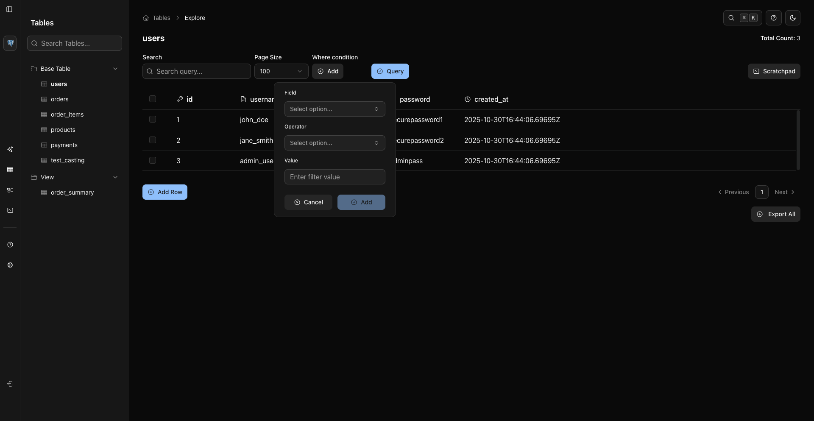

### Export dialog
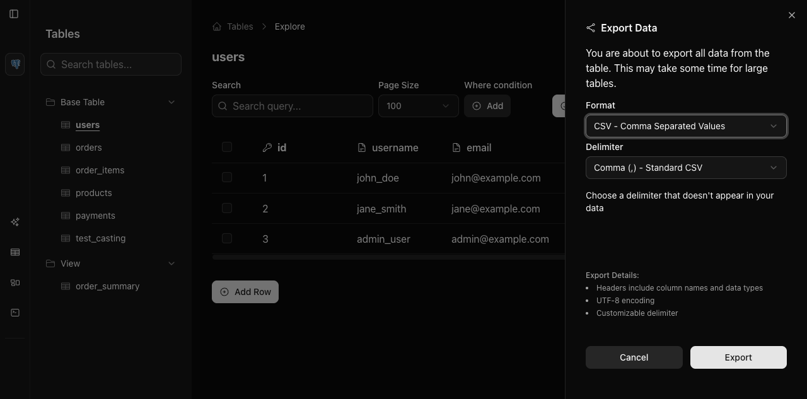

### Schema graph
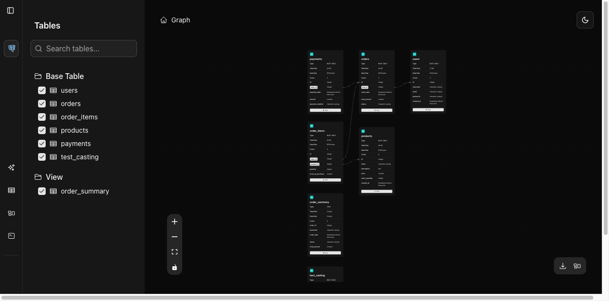

### Scratchpad
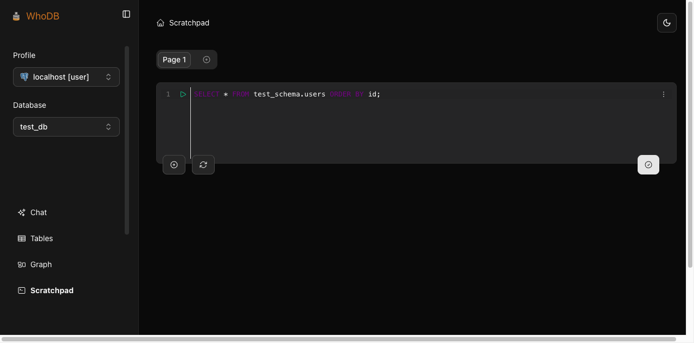

### Query results
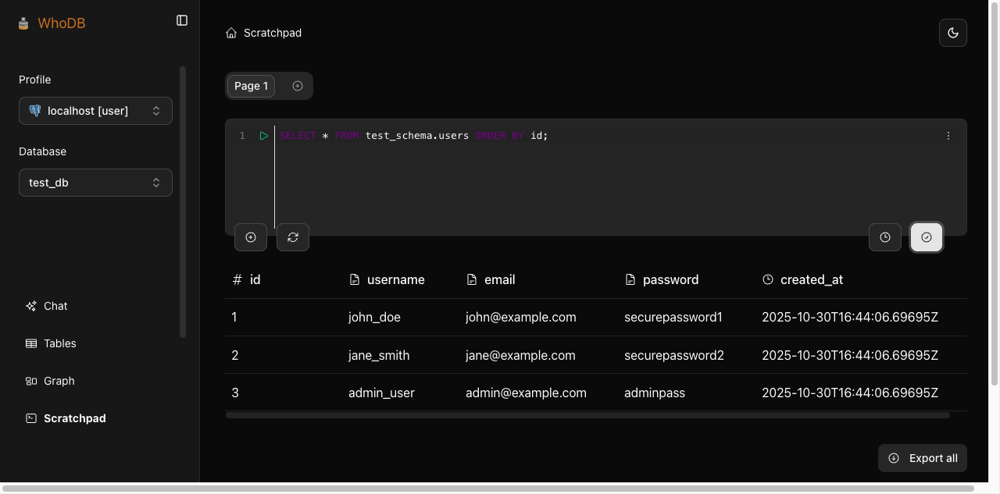

### Database selector
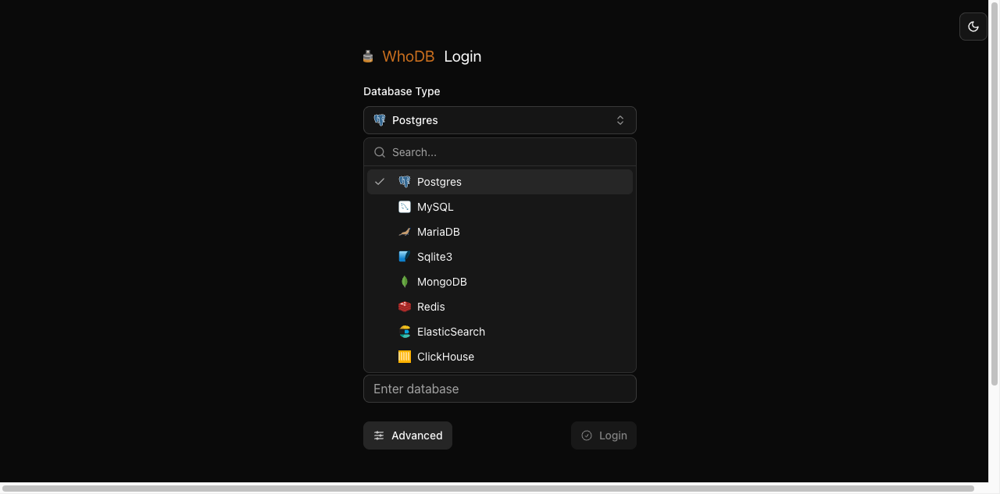

</details>

---

## Infrastructure and Support

WhoDB's deployment and CI/CD are powered by [Clidey](https://clidey.com).

<!-- **Build Status:** [](https://clidey.com) -->

### WhoDB Platform

Looking to go beyond WhoDB Community? WhoDB Platform runs on your infrastructure and adds pipelines, live dashboards, data catalog, governance, SSO, and air-gapped deployment support.

- **Platform overview:** [whodb.com/platform](https://whodb.com/platform/)
- **Pricing:** [whodb.com/pricing](https://whodb.com/pricing/)
- **Contact sales:** [support@clidey.com](mailto:support@clidey.com)

### Support

- **Email:** [support@clidey.com](mailto:support@clidey.com)
- **GitHub Issues:** [github.com/clidey/whodb/issues](https://github.com/clidey/whodb/issues)
- **Discussions:** [github.com/clidey/whodb/discussions](https://github.com/clidey/whodb/discussions)
- **Docs:** [docs.whodb.com](https://docs.whodb.com/)

---

<div align="center">

If WhoDB has saved you time, a star helps the project reach more people.

[](https://github.com/clidey/whodb/stargazers)

**Built with ❤️ by the Clidey team**

*"Is it magic? Is it sorcery? No, it's just WhoDB!"*

</div>
