<div align="center">

#   whodb

### *Lightweight, Fast, and Beautiful Database Management*

<!-- [](https://clidey.com) -->


[](LICENSE)
[](https://github.com/clidey/whodb/stargazers)


[](https://goreportcard.com/report/github.com/clidey/whodb/core)

## Available on

[](https://hub.docker.com/repository/docker/clidey/whodb)
[](https://apps.microsoft.com/detail/9pftx5bv4ds6)
[](https://apps.apple.com/app/whodb/id6754566536)
[](http://snapcraft.io/whodb)

[🚀 Quick Start](#quick-start) • [📖 Documentation](https://docs.whodb.com/) • [🎮 Live Demo](https://whodb.com/demo/login?host=quick-container-491288b0-3138-48fa-93b4-1e730296c0b7.hello.svc.cluster.local&username=user&password=password&database=Adventureworks) • [💬 Community](https://github.com/clidey/whodb/discussions)

</div>

---

<p align="center">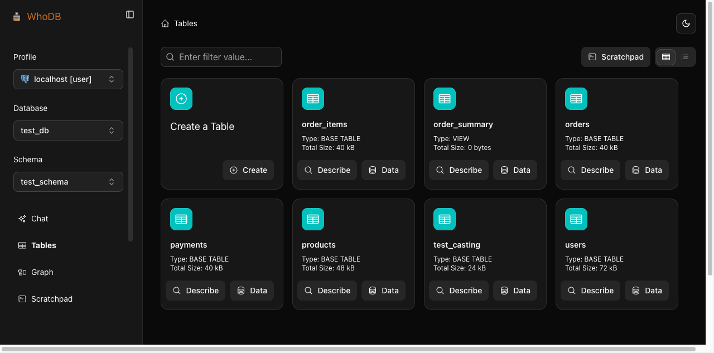</p>

## 🎯 What is WhoDB?

**WhoDB is the modern database management tool that developers actually want to use.**

Built with GoLang and React, WhoDB is a lightweight (<50MB) yet powerful database client that combines blazing-fast performance with an intuitive, beautiful interface. Whether you're debugging a production issue, exploring a new database schema, or managing data for your next feature, WhoDB makes database management feel effortless.

### Why WhoDB?

<table>
<tr>
<td width="50%">

**🚀 Lightning Fast**
- Instant startup (<1s)
- Real-time query results
- Efficient table virtualization
- 90% less resource usage than traditional tools

**🎨 Beautiful & Intuitive**
- Clean, modern interface
- Spreadsheet-like data grid
- Interactive schema visualization
- No training required

</td>
<td width="50%">

**🤖 AI-Powered**
- Natural language to SQL
- Talk to your data conversationally
- Supports Ollama, OpenAI, and Anthropic
- No complex query writing needed

**🔧 Developer-Friendly**
- Multi-database support
- Query history & management
- Mock data generation
- Flexible export options

</td>
</tr>
</table>

## ✨ Key Features

### 📊 Visual Data Management

<table>
<tr>
<td width="50%">
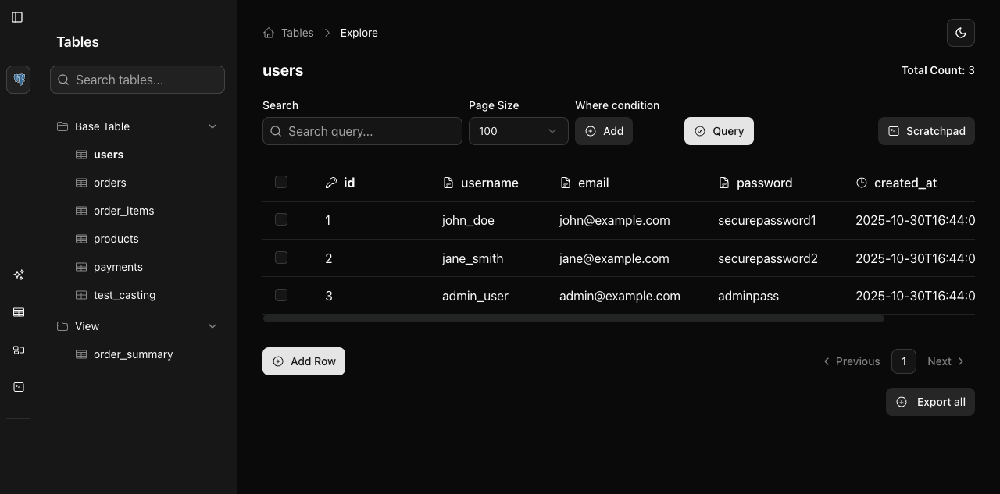
</td>
<td width="50%">

**Spreadsheet-Like Data Grid**
- View, edit, and manage data intuitively
- Sort, filter, and search with ease
- Inline editing with real-time updates
- Bulk operations for efficiency

</td>
</tr>
</table>

### 🔍 Interactive Schema Explorer

<table>
<tr>
<td width="50%">

**Visual Schema Topology**
- Interactive graph visualization
- Explore table relationships
- Understand foreign keys instantly
- Pan, zoom, and navigate easily

</td>
<td width="50%">
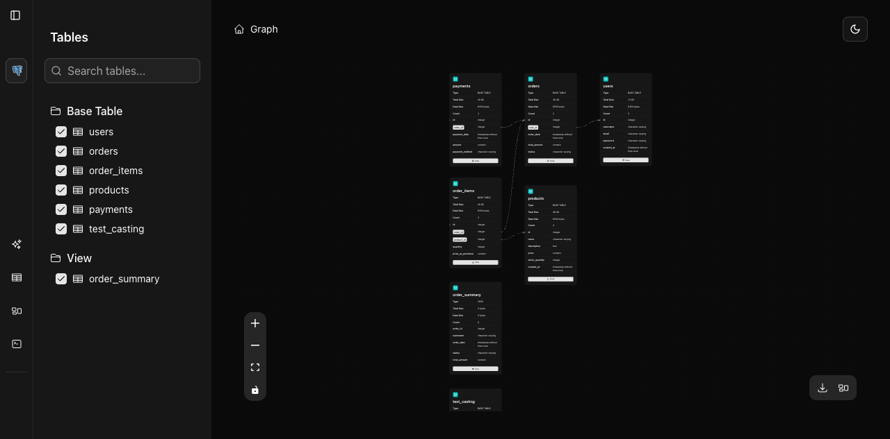
</td>
</tr>
</table>

### 💻 Powerful Query Interface

<table>
<tr>
<td width="50%">
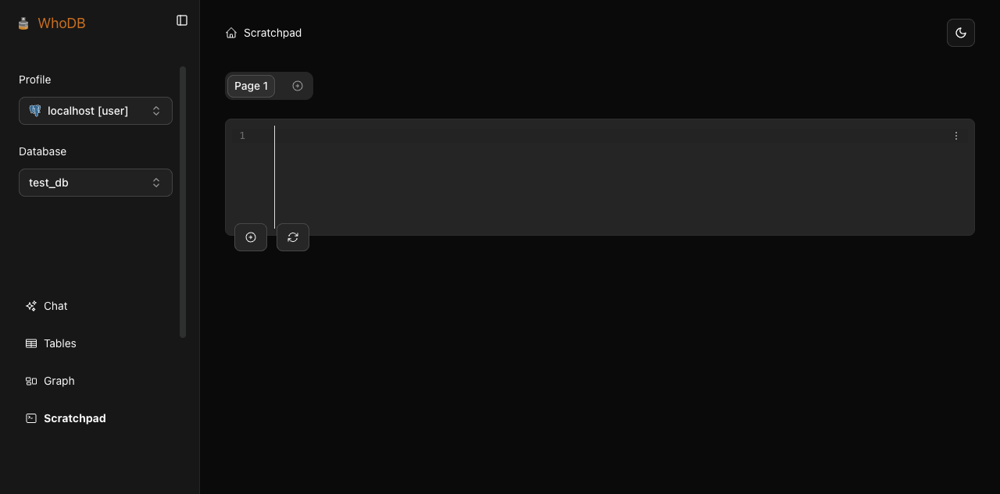
</td>
<td width="50%">

**Scratchpad Query Editor**
- Jupyter-like notebook interface
- Syntax highlighting & auto-completion
- Query history & reuse
- Multi-cell organization

</td>
</tr>
</table>

### 🗄️ Multi-Database Support

**Community Edition (CE):** PostgreSQL, MySQL, SQLite3, MongoDB, Redis, MariaDB, ElasticSearch

**Enterprise Edition (EE):** All CE databases plus Oracle, SQL Server, DynamoDB, Athena, Snowflake, Cassandra, and more

### 🎯 Advanced Capabilities

- **Mock Data Generation** - Generate realistic test data for development
- **Flexible Export Options** - Export to CSV, Excel, JSON, or SQL
- **Advanced Filtering** - Build complex WHERE conditions visually
- **AI-Powered Queries** - Convert natural language to SQL with Ollama, OpenAI, or Anthropic

---

## 🎮 Try WhoDB Now

<div align="center">

**Experience WhoDB in action without any setup**

<table>
<tr>
<td align="center" width="50%">
<h3>🌐 Live Demo</h3>
<p>Try WhoDB instantly with our sample database</p>
<a href="https://whodb.com/demo/login?host=quick-container-491288b0-3138-48fa-93b4-1e730296c0b7.hello.svc.cluster.local&username=user&password=password&database=Adventureworks">
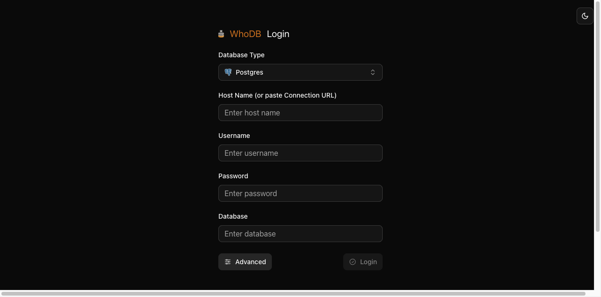
</a>
<p><a href="https://whodb.com/demo/login?host=quick-container-491288b0-3138-48fa-93b4-1e730296c0b7.hello.svc.cluster.local&username=user&password=password&database=Adventureworks"><strong>Launch Demo →</strong></a></p>
<p><em>Pre-filled with sample PostgreSQL database</em></p>
</td>
<td align="center" width="50%">
<h3>🎥 Video Demo</h3>
<p>Watch WhoDB in action</p>
<a href="https://youtu.be/hnAQcYYzcLo">

</a>
<p><a href="https://youtu.be/hnAQcYYzcLo"><strong>Watch Video →</strong></a></p>
<p><em>Complete walkthrough of features</em></p>
</td>
</tr>
</table>

</div>

---

## 🚀 Quick Start

### Option 1: Docker (Recommended)

The fastest way to get started with WhoDB:

```bash
docker run -it -p 8080:8080 clidey/whodb
```

Then open [http://localhost:8080](http://localhost:8080) in your browser.

### Option 2: Docker Compose

For more control and configuration:

```yaml
version: "3.8"
services:
  whodb:
    image: clidey/whodb
    ports:
      - "8080:8080"
    environment:
      # AI Integration (Optional)
      # Ollama Configuration
      - WHODB_OLLAMA_HOST=localhost
      - WHODB_OLLAMA_PORT=11434

      # Anthropic Configuration
      - WHODB_ANTHROPIC_API_KEY=your_key_here
      # - WHODB_ANTHROPIC_ENDPOINT=https://api.anthropic.com/v1

      # OpenAI Configuration
      - WHODB_OPENAI_API_KEY=your_key_here
      # - WHODB_OPENAI_ENDPOINT=https://api.openai.com/v1
    # volumes: # (Optional for SQLite)
    #   - ./sample.db:/db/sample.db
```

### What's Next?

1. **Connect to your database** - Enter your database credentials on the login page
2. **Explore your schema** - Browse tables and visualize relationships
3. **Run queries** - Use the Scratchpad to execute SQL queries
4. **Manage data** - Edit, add, and delete records with ease

📖 **For detailed installation options and configuration**, see our [Documentation](https://docs.whodb.com/)

---

## 🛠️ Development Setup

### Prerequisites

- **GoLang** - Latest version recommended
- **PNPM** - For frontend package management
- **Node.js** - Version 16 or higher

### Editions

<table>
<tr>
<td width="50%">

**Community Edition (CE)**
- PostgreSQL
- MySQL / MariaDB
- SQLite3
- MongoDB
- Redis
- ElasticSearch

</td>
<td width="50%">

**Enterprise Edition (EE)**
- All CE databases
- Oracle
- SQL Server
- DynamoDB
- Athena
- Snowflake
- Cassandra
- And more...

</td>
</tr>
</table>

📚 See [BUILD_AND_RUN.md](./BUILD_AND_RUN.md) for detailed build instructions and [ARCHITECTURE.md](./ARCHITECTURE.md) for architecture details.

### Frontend Development

Navigate to the `frontend/` directory and start the development server:

```bash
cd frontend
pnpm i
pnpm start
```

### Backend Development

#### 1. Build Frontend (First-Time Setup)

If the `core/build/` directory doesn't exist, build the frontend first:

```bash
cd frontend
pnpm install
pnpm run build
rm -rf ../core/build/
cp -r ./build ../core/
cd ..
```

> **Note:** This is only required once, as Go embeds the `build/` folder on startup.

#### 2. Setup AI Integration (Optional)

To enable natural language queries:

1. **Ollama** - Download from [ollama.com](https://ollama.com/)
   ```bash
   # Install Llama 3.1 8b model
   ollama pull llama3.1
   ```
   WhoDB will auto-detect installed models and show a **Chat** option in the sidebar.

2. **OpenAI/Anthropic** - Set environment variables (see Docker Compose example above)

#### 3. Start Backend Service

```bash
cd core
go run .
```

The backend will start on `http://localhost:8080`

---

## 💼 Use Cases

### 👨‍💻 For Developers

<table>
<tr>
<td width="50%">

**Local Development**
- Quick database inspection during development
- Debug production issues with read-only access
- Test API endpoints with real data
- Explore schema changes

</td>
<td width="50%">

**API Development**
- Validate data transformations
- Test query performance
- Generate mock data for testing
- Export data for integration tests

</td>
</tr>
</table>

### 📊 For Data Analysts

- Run ad-hoc SQL queries quickly
- Export data to Excel for analysis
- Build complex filters visually
- Visualize table relationships

### 🧪 For QA Engineers

- Generate realistic test data
- Verify database state during testing
- Debug test failures quickly
- Validate data migrations

### 🛠️ For Database Administrators

- Monitor table structures and indexes
- Manage user data efficiently
- Quick schema exploration
- Emergency data fixes

---

## ❓ Frequently Asked Questions

<details>
<summary><strong>What makes WhoDB different from other database tools?</strong></summary>
<br>

WhoDB combines the lightweight nature of tools like Adminer with modern UX, powerful visualizations, and AI capabilities. Unlike resource-heavy tools like DBeaver, WhoDB uses 90% less memory while providing a faster, more intuitive experience.

</details>

<details>
<summary><strong>Is WhoDB suitable for production use?</strong></summary>
<br>

Yes, WhoDB is production-ready and used by thousands of developers. For production environments, we recommend:
- Using read-only database accounts when possible
- Enabling SSL/TLS connections
- Consider Enterprise Edition for audit logging and advanced security features

</details>

<details>
<summary><strong>How does WhoDB handle large datasets?</strong></summary>
<br>

WhoDB implements several performance optimizations:
- Table virtualization for efficient rendering
- Lazy loading for large result sets
- Pagination controls
- Query result streaming

</details>

<details>
<summary><strong>Which databases are supported?</strong></summary>
<br>

**Community Edition:** PostgreSQL, MySQL, MariaDB, SQLite3, MongoDB, Redis, ElasticSearch

**Enterprise Edition:** All CE databases plus Oracle, SQL Server, DynamoDB, Athena, Snowflake, Cassandra, and more

</details>

<details>
<summary><strong>How do I deploy WhoDB?</strong></summary>
<br>

WhoDB can be deployed in multiple ways:
- **Docker** - Single command deployment
- **Docker Compose** - For production setups
- **Kubernetes** - For enterprise environments
- **Binary** - Direct installation on servers

See our [Quick Start](#quick-start) section for details.

</details>

<details>
<summary><strong>Does WhoDB store my credentials?</strong></summary>
<br>

No. WhoDB does not store database credentials by default. Connections are temporary and credentials are cleared when you close the browser. You can optionally configure connection profiles stored locally in your browser.

</details>

<details>
<summary><strong>Can I use WhoDB with AI features?</strong></summary>
<br>

Yes! WhoDB integrates with:
- **Ollama** - For local, private AI models
- **OpenAI** - GPT-4 and other OpenAI models
- **Anthropic** - Claude models

These integrations allow you to query your database using natural language instead of SQL.

</details>

## 🤝 Contributing

We welcome contributions from the community! Whether it's bug reports, feature requests, or code contributions, we appreciate your help in making WhoDB better.

### How to Contribute

1. **Report Issues** - Found a bug? [Open an issue](https://github.com/clidey/whodb/issues)
2. **Request Features** - Have an idea? [Start a discussion](https://github.com/clidey/whodb/discussions)
3. **Submit PRs** - Want to contribute code? Check our [Contributing Guide](CONTRIBUTING.md)
4. **Improve Docs** - Help us improve documentation

### Development Resources

- [Contributing Guide](CONTRIBUTING.md) - Detailed contribution guidelines
- [Architecture](ARCHITECTURE.md) - Understanding the codebase
- [Build & Run](BUILD_AND_RUN.md) - Development setup instructions

---

## 📸 Screenshots

<details>
<summary><strong>View More Screenshots</strong></summary>

### Data Management


### Add/Edit Records
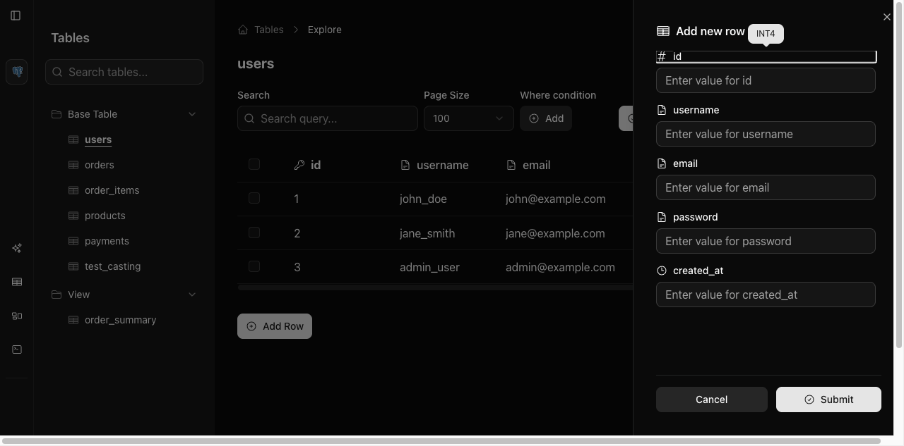

### Advanced Filtering
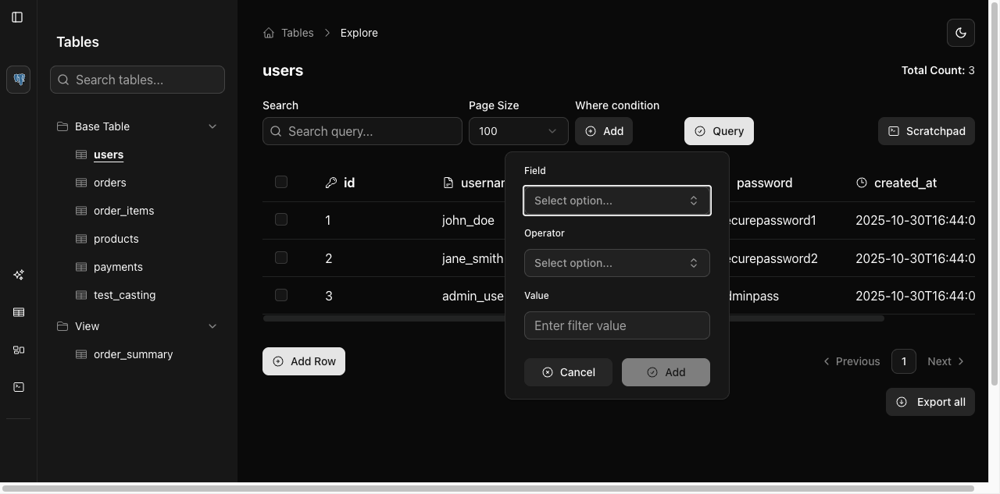

### Export Options
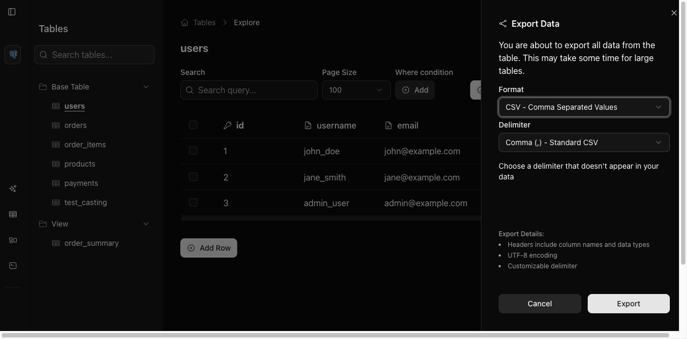

### Schema Graph Visualization
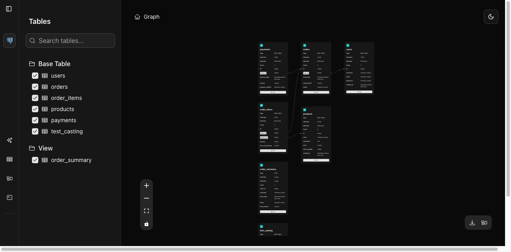

### Scratchpad Query Editor
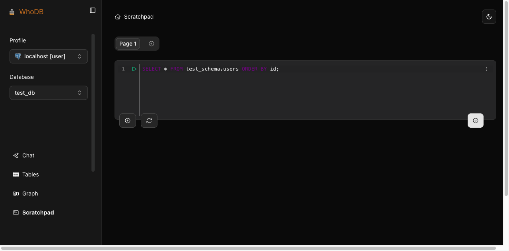

### Query Results
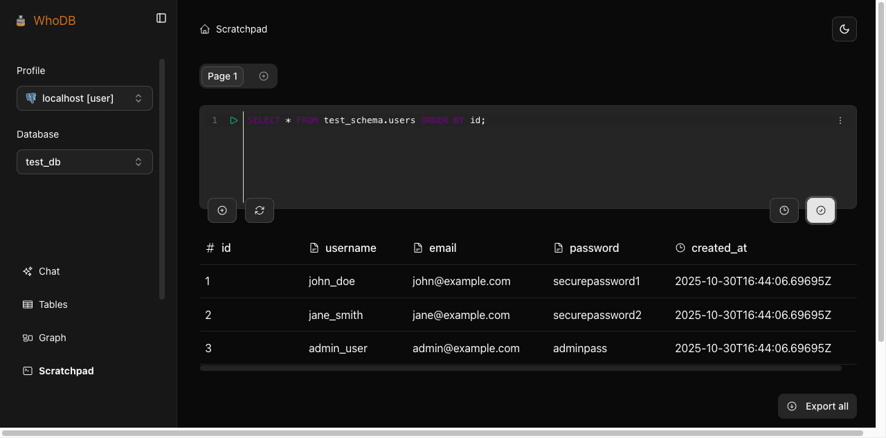

### Multiple Database Support
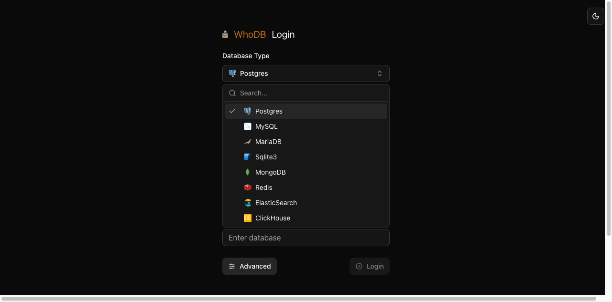

</details>

---

## 🏢 Infrastructure & Support

WhoDB's deployment and CI/CD are powered by [Clidey](https://clidey.com), a no-code DevOps platform.

<!-- **Build Status:** [](https://clidey.com) -->

### Contact & Support

- **Email:** [support@clidey.com](mailto:support@clidey.com)
- **GitHub Issues:** [Report a bug](https://github.com/clidey/whodb/issues)
- **Discussions:** [Join the conversation](https://github.com/clidey/whodb/discussions)
- **Documentation:** [docs.whodb.com](https://docs.whodb.com/)

---

<div align="center">

### ⭐ Star Us on GitHub!

If you find WhoDB useful, please consider giving us a star on GitHub. It helps us grow the community and continue improving WhoDB.

[](https://github.com/clidey/whodb/stargazers)

---

**Built with ❤️ by the Clidey team**

*"Is it magic? Is it sorcery? No, it's just WhoDB!"*

</div>
