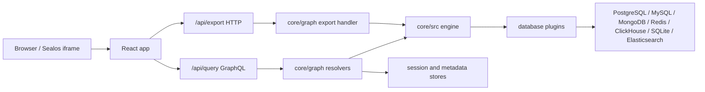

# Architecture

DataFlow combines a Go backend under `core/` with a React/Vite frontend under `dataflow/`. The backend owns connection lifecycle, plugin-specific database operations, GraphQL resolvers, selected HTTP endpoints, session handling, and production asset serving. The frontend owns authentication bootstrap, workspace layout, query/editing views, dashboards, and local UI state.

## Runtime Shape

## Backend Modules

- `core/server.go`: process entrypoint, engine initialization, provider setup, router creation, graceful shutdown.
- `core/src/router`: Chi router setup, middleware, `/health`, GraphQL transport, static asset serving in production builds.
- `core/graph`: GraphQL schema, generated code, resolvers, and HTTP handlers such as export/import or AI streaming.
- `core/src/engine`: shared database plugin interface, base plugin behavior, connection config, metadata contracts.
- `core/src/plugins`: database-specific implementations. Shared code must not branch on database type for plugin behavior that belongs in a plugin.
- `core/src/session`: server-side auth session handling for standalone and Sealos bootstrap flows.
- `core/src/sealos`: Kubernetes secret and service resolution for Sealos database bootstrap.
- `core/src/env` and `core/src/envconfig`: environment declarations and config loading that may need logging.

## Frontend Modules

- `dataflow/src/main.tsx`: app bootstrap, i18n provider, Apollo provider, auth gate, and main layout.
- `dataflow/src/config`: Apollo client, auth headers, persisted auth state, Sealos runtime helpers.
- `dataflow/src/stores`: Zustand stores for auth, connection context, workspace tabs, layout, and analysis state.
- `dataflow/src/components/layout`: activity rail, resizable sidebar region, database workspace tabs, dashboard view switching, leave guard.
- `dataflow/src/components/sidebar` and `dashboard-sidebar`: navigation surfaces for database resources and dashboards.
- `dataflow/src/components/database`: SQL, MongoDB, Redis, and shared data-view components.
- `dataflow/src/components/editor`: SQL, MongoDB, and Redis command execution surfaces.
- `dataflow/src/components/analysis`: dashboard editor, widget canvas, and chart creation flow.
- `dataflow/src/graphql`: `.graphql` operations used by GraphQL codegen.
- `dataflow/src/generated`: generated GraphQL TypeScript types and hooks.

## API Boundaries

GraphQL is the default API boundary for application behavior. The main endpoint is `/api/query`, backed by gqlgen in `core/graph`.

HTTP endpoints are reserved for behaviors that do not fit GraphQL cleanly, especially file transfer and streaming:

- `/api/export` streams CSV, Excel, or NDJSON export responses.
- `/health` is served by middleware before authentication for readiness checks.
- Static frontend assets are served by the backend in production builds unless API gateway mode is enabled.

## Authentication And Context

The frontend starts in `AppBootstrap` and initializes `useAuthStore`.

- In Sealos context, URL parameters describe the target database resource. The frontend asks the backend to bootstrap a server-side session, then strips bootstrap parameters from the URL.
- In standalone context, users create a session through the login form unless standalone login is disabled by server settings.
- Apollo requests and export requests use `addAuthHeader` to attach session credentials and optional database override headers.
- Expired sessions can trigger rebootstrap for Sealos sessions or standalone unauthorized handling for manual login sessions.

## Database Plugin Flow

The backend chooses a plugin from `src.MainEngine` based on the session's database type. Shared resolvers call plugin interface methods rather than branching on database type. SQL-like plugins build on the GORM plugin base. MongoDB, Redis, and other non-relational connectors own their data model details inside their plugin implementations.

## Packaging

Production images are built by `core/Dockerfile`.

- The first stage builds the React frontend with `pnpm`.
- The backend stage compiles the Go binary with `-tags prod` and embeds the frontend build output.
- The Dockerfile pre-downloads the BAML native library for the target Linux architecture and sets `BAML_LIBRARY_PATH`.
- The final Alpine image runs `/core`.

Sealos packaging lives under `deploy/`:

- `deploy/charts/dataflow` contains the Helm chart.
- `deploy/Kubefile` builds the cluster image.
- `.github/workflows/release.yaml` builds runtime images, builds Sealos cluster images, publishes manifests, syncs tarballs to OSS, and creates GitHub Releases for tag pushes.

## Key Tradeoffs

- The frontend keeps most workspace UI state in Zustand for quick local interaction and testability.
- GraphQL remains the default API, while file export stays HTTP to preserve download semantics.
- MongoDB collection browsing uses a grid view while preserving MongoDB document terminology and field-order behavior.
- Release packaging is CI-centered because multi-arch runtime and Sealos images require architecture-specific build and cache steps.
