# Whodb

Whodb is a powerful database management tool designed to simplify and enhance your database interaction. With support for various database types and a user-friendly interface, Whodb allows you to easily manage, visualize, and interact with your database.

## Features

- **Login and Authentication**: Securely log in to your database.
- **Database Selection**: Choose your database type, username, password, and specific database.
- **Side Bar Navigation**: Access different sections like Login Profile, Table Schema, Tables, Graph Visualization, and Raw Execute.
- **Table Schema**: View detailed schemas of your tables.
- **Table Management**: Navigate directly to tables, check basic information, view and filter data, and export to CSV.
- **Graph Visualization**: Visualize how tables are interconnected.
- **Raw SQL Execution**: Perform arbitrary SQL queries.
- **Inline Preview**: Click & hold a cell to preview value (string, JSON, or Markdown)
- **Inline Edit**: Click "Edit" Icon, edit changes easily, and apply right away.

## Getting Started

1. Run the docker command to pull & start WhoDB:
    ```sh
    docker run -it -p 8080:8080 clidey/whodb
    ```

2. Open your browser and navigate to `http://localhost:8080`.

## Using Whodb

### Login

- Upon starting the application, navigate to `http://localhost:8080`.
- You will be presented with a login screen.
  <br /><p align="center"></p>
- Select your database type, enter your username, password, and database name.
  <br /><p align="center">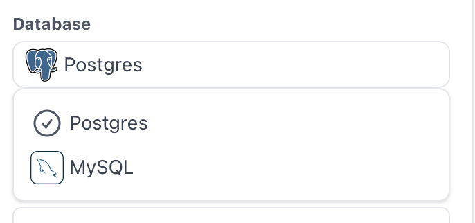</p>

NOTE: When selecting SQLite Database - you would need to mount one or more database files to /db/ inside the docker container. For example:

```sh
docker run -it -v ./sample.db:/db/sample.db -p 8080:8080 clidey/whodb:latest
```

### Side Bar Navigation

- After logging in, you will see a side bar with the following options:
  - **Login Profile**: Manage your login credentials.
    <br /><p align="center">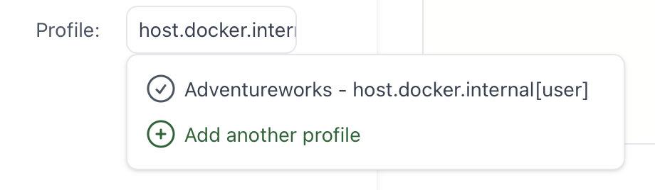</p>
  - **Table Schema**: View and explore table schemas.
  - **Tables**: Access tables to view basic information and data.
  - **Graph Visualization**: See how tables are interconnected.
  - **Raw Execute**: Perform arbitrary SQL queries.

### Table Schema

- Select "Table Schema" from the side bar to view detailed information about your table schemas.
  <br /><p align="center">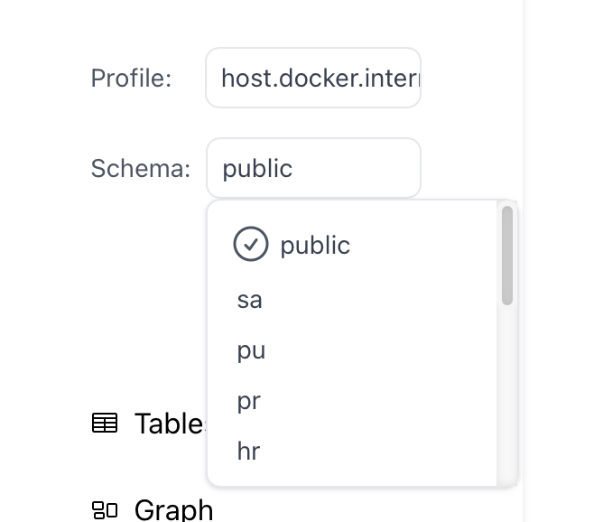</p>

### Tables

- Select "Tables" from the side bar to view and manage your tables.
  <br /><p align="center">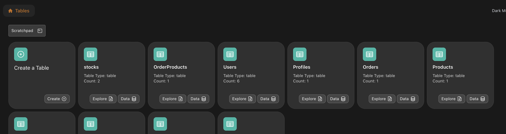</p>
- Click on a table to see its basic information and data.
  <br /><p align="center">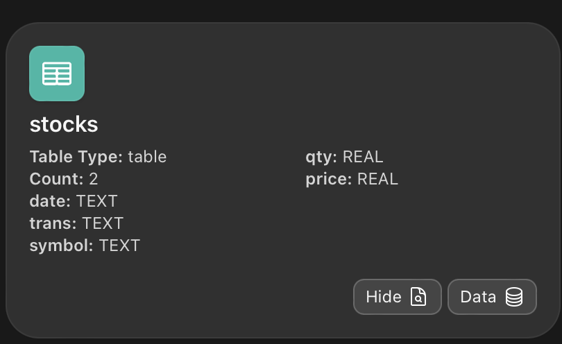</p>
- Inside the table card, hit "Data" to view the table's data (paged to 10 rows by default).
  <br /><p align="center">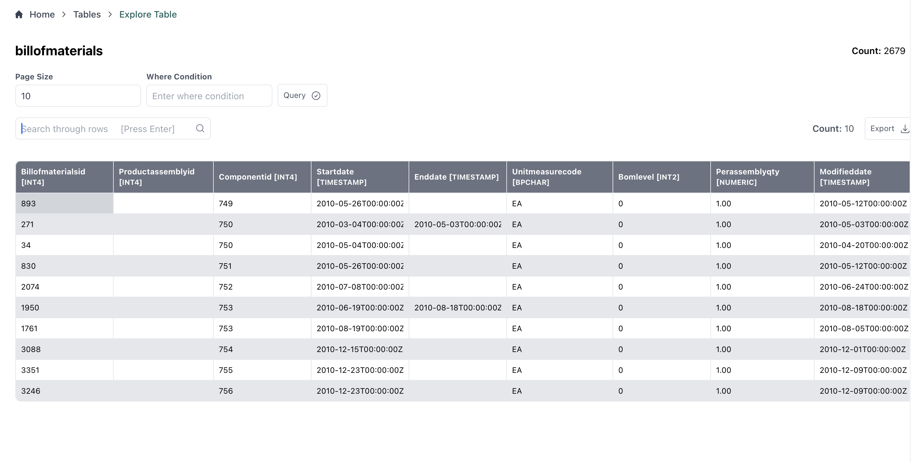</p>
- Change the number of rows per page using the configuration on top.
  <br /><p align="center">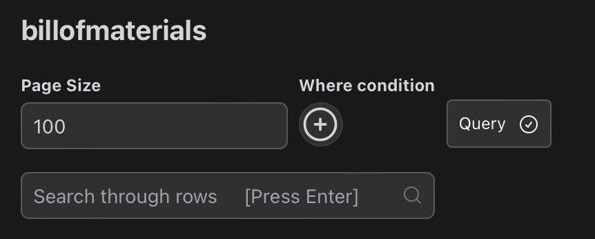</p>
- Apply filters (e.g., `id=10` or `component_name='Name'`) to narrow down your data set.
- Export the filtered data to CSV using the export option on the right side.
  <br /><p align="center">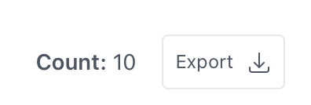</p>
- Use the search feature to quickly find specific data within the table.
  <br /><p align="center">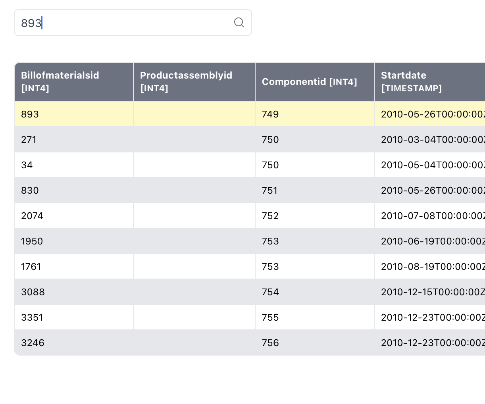</p>
- Click on a cell and hold to preview the value easily. Currently, WhoDB supports previewing **string**, **JSON**, and **Markdown** values. For example, Markdowns would be shown like this:
 <br /><p align="center">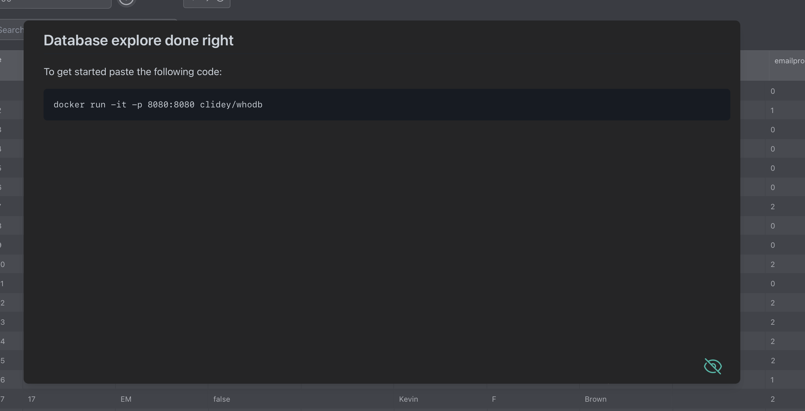</p>
- Easily edit the content of the cell by simply hitting "Edit" icon. 
<br /><p align="center">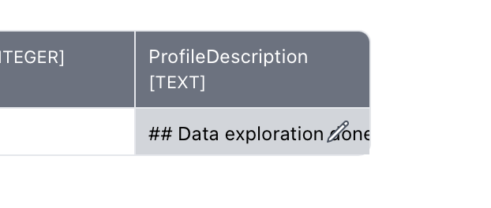</p>
This should show a popup like below and you can hit "Check" to apply changes. It should reflect in the cell right away if the action is successful! [Note: on the bottom right, "Preview" icon will show for support previews. Click to switch to preview mode]
<br /><p align="center">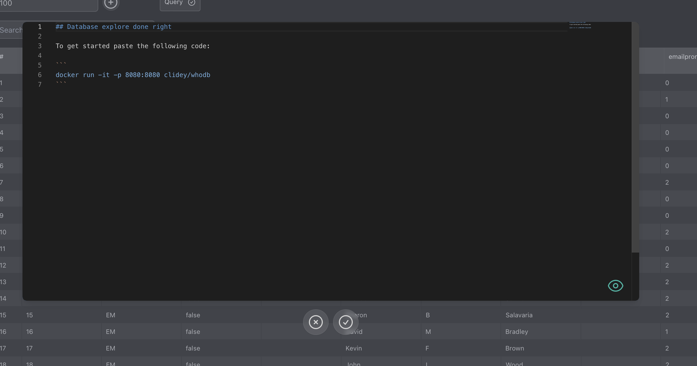</p>

### Graph Visualization

- Select "Graph" from the side bar to see how all tables are interconnected.
  <br /><p align="center">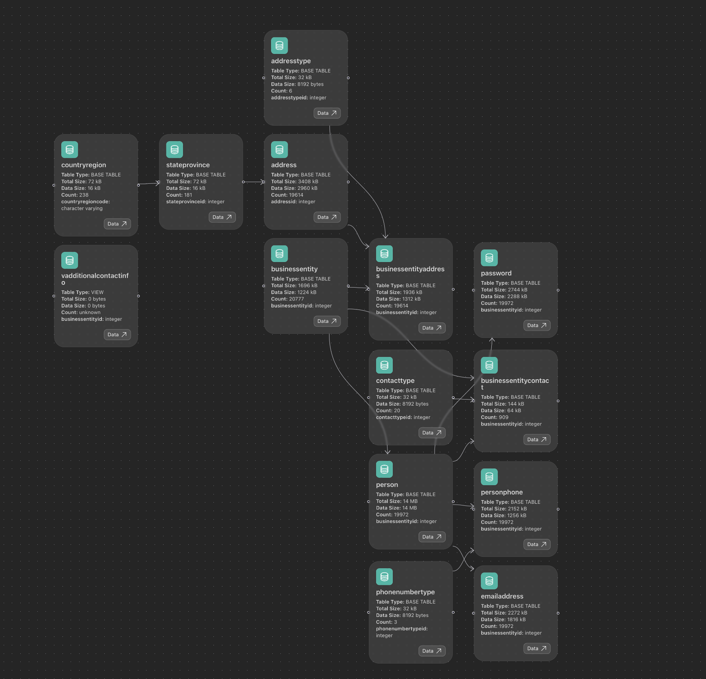</p>
- You can directly go to a "Table" directly from the graph
  <br /><p align="center">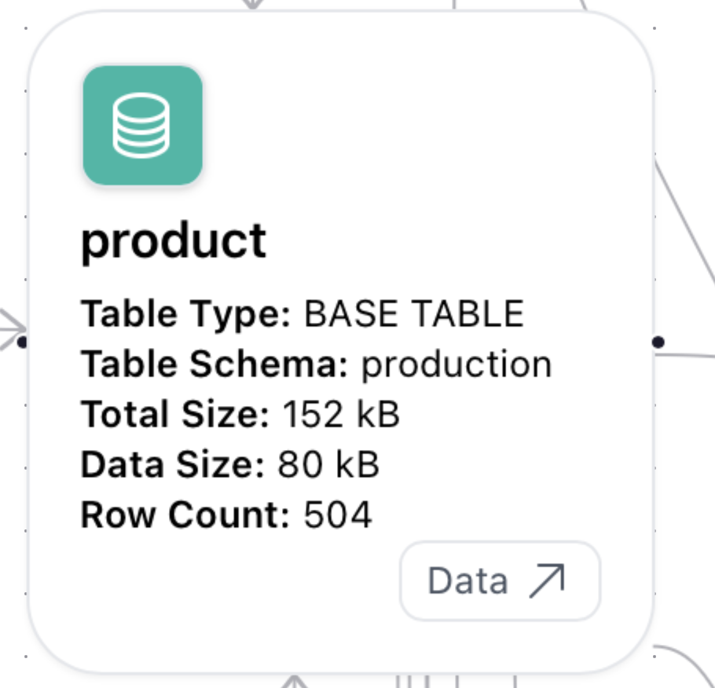</p>
  - **Pending Feature**: View the type of connection (e.g., OneToOne, ManyToOne) and constraints (e.g., nullable) on foreign keys.


### Raw Execute

- Go to "Raw Execute" in the side bar to perform arbitrary SQL queries directly.
  <br /><p align="center">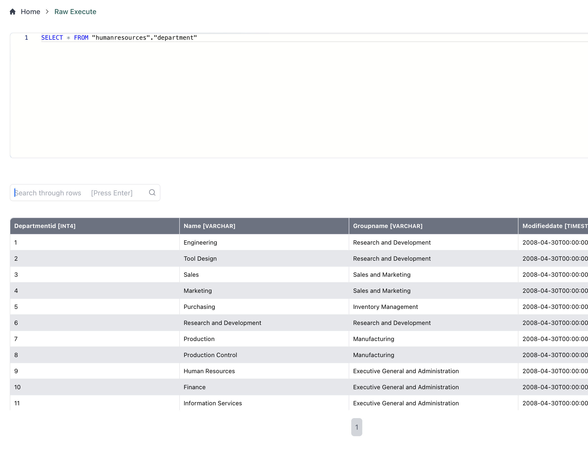</p>

## Pending Features

- **Database Support**: Currently supports Postgres, MySQL, & SQLite. Support for MongoDB, Neo4JS, etc., is coming soon with the same experience.
- **Detailed Graph Visualization**: Display connection types and constraints on foreign keys.

## Contributing

Contributions are welcome! Please submit a pull request or open an issue to discuss what you would like to change.
