# Whodb

Whodb is a powerful database management tool designed to simplify and enhance your database interaction. With support for various database types and a user-friendly interface, Whodb allows you to easily manage, visualize, and interact with your database.

## Features

- **Conversate With Your Data:** No more wasting time crafting complex SQL queries - ask away!
- **Login Profiles & Authentication**: Securely log in to your database.
- **Database Selection**: Choose your database type, username, password, and specific database.
- **Side Bar Navigation**: Access different sections like Login Profile, Table Schema, Tables, Graph Visualization, and Scratchpad.
- **Table Schema**: View detailed schemas of your tables.
- **Table Management**: Navigate directly to tables, check basic information, view and filter data, and export to CSV.
- **Graph Visualization**: Visualize how tables are interconnected.
- **Scratchpad**: Perform arbitrary SQL queries with Jupyter notebook like experience.
- **Inline Preview**: Click & hold a cell to preview value (string, JSON, or Markdown)
- **Inline Edit**: Click "Edit" Icon, edit changes easily, and apply right away.
- **Smart filters**: Easily create filters across all databases with the same UX.
- **Add data with ease**: Create tables or add data to tables with ease.

## Getting Started

1. Run the docker command to pull & start WhoDB:
    ```sh
    docker run -it -p 8080:8080 clidey/whodb
    ```

2. Open your browser and navigate to `http://localhost:8080`.

## Using Whodb

### Login

- Upon starting the application, navigate to `http://localhost:8080`.
- You will be presented with a login screen.
  <br /><p align="center"></p>
- Select your database type, enter your username, password, and database name.
  <br /><p align="center"></p>

NOTE: When selecting SQLite Database - you would need to mount one or more database files to /db/ inside the docker container. For example:

```sh
docker run -it -v ./sample.db:/db/sample.db -p 8080:8080 clidey/whodb:latest
```

### Login Profiles (Environment Variables Setup)

Now, you can configure Whodb to use pre-configured database login profiles using environment variables. This allows for easy switching between different database configurations without exposing passwords to the frontend.

#### Using Environment Variables
You can define environment variables to specify multiple database configurations. Here are the formats supported:

**Single Database Configuration:** Use WHODB_DATABASETYPE_1='{}' where DATABASETYPE can be POSTGRES, MYSQL, SQLITE3, etc., to configure the first profile.

Example:

```bash
WHODB_POSTGRES_1='{"host":"localhost","user":"user","password":"password","database":"postgres"}'
WHODB_SQLITE3_1='{"database":"sample.db"}'
```

**Multiple Database Configurations:** Alternatively, you can use a list of JSON objects in WHODB_DATABASETYPE='[{}]' format to define multiple profiles for a database type.


Example:

```bash
WHODB_MYSQL='[{"host":"localhost","user":"user","password":"password","database":"mysql"}]'
```

Docker compose example:

```yaml
version: '3.7'
services:
  whodb:
    image: clidey/whodb
    ports:
      - "8080:8080"
    environment:
      WHODB_POSTGRES_1: '{"host":"localhost","user":"user","password":"password","database":"postgres"}'
      WHODB_MYSQL: '[{"host":"localhost","user":"user","password":"password","database":"mysql"}]'
      WHODB_SQLITE3_1: '{"database":"sample.db"}'
```

#### Using in Whodb
Once configured, you can switch between these profiles within the Whodb application:

- Navigate to the login page.
- At the bottom of the login form, select the profile you want to use.
  <br /><p align="center">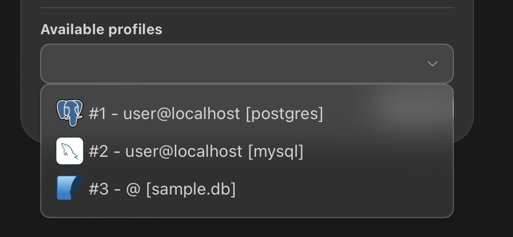</p>
- Profiles can also be switched using the sidebar as before, ensuring seamless integration with existing workflows.

##### Security Note: Passwords are not sent to the frontend, ensuring secure handling of sensitive information.

### Side Bar Navigation

- After logging in, you will see a side bar with the following options:
  - **Login Profile**: Manage your login credentials.
    <br /><p align="center"></p>
  - **Table Schema**: View and explore table schemas.
  - **Tables**: Access tables to view basic information and data.
  - **Graph Visualization**: See how tables are interconnected.
  - **Scratchpad**: Perform arbitrary SQL queries with Jupyter notebook like experience.

### Table Schema

- Select "Table Schema" from the side bar to view detailed information about your table schemas.
  <br /><p align="center"></p>

### Houdini

#### Overview

Houdini lets you interact with your data sources through a natural, conversational interface. Simply type in English, and Houdini will automatically understand and respond using the relevant data.

#### Getting started

- Visit [Ollama's website](https://ollama.com) and follow the installation instructions.
- Once installed, run your desired model (e.g., Llama3.1) with the following command:

```bash
ollama run ollama3.1
```

#### Using Houdini
- After installing Ollama, you’ll find the "Chat" feature available in the sidebar navigation.
- This feature offers a ChatGPT-like experience, allowing you to engage in natural conversations with your data.

<br /><p align="center">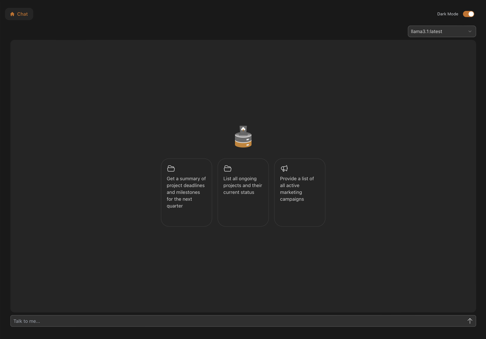</p>

**Note:** All data processing is done locally on your computer, ensuring complete privacy.

<details>
    <summary>View screenshots on examples</summary>
    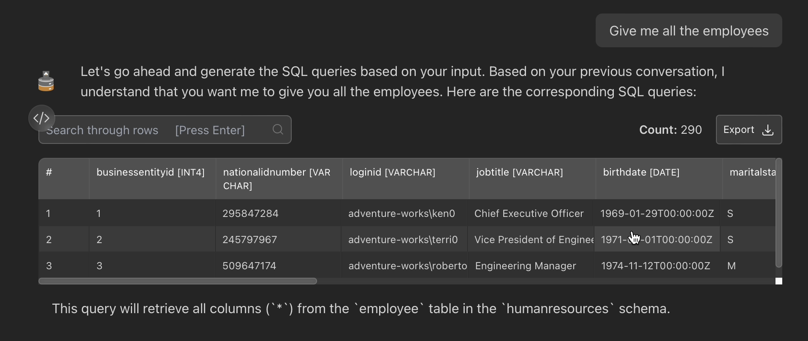
    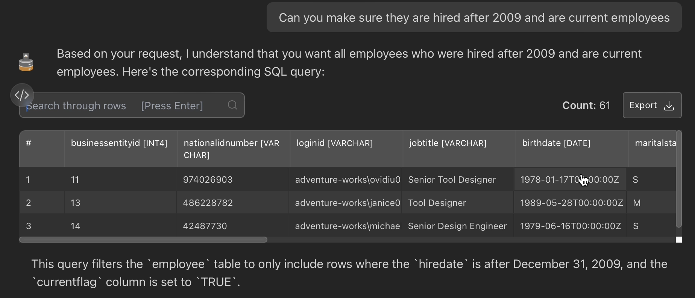
    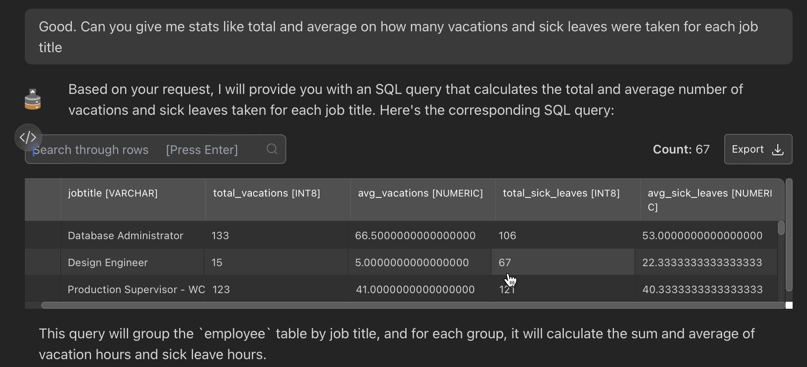
    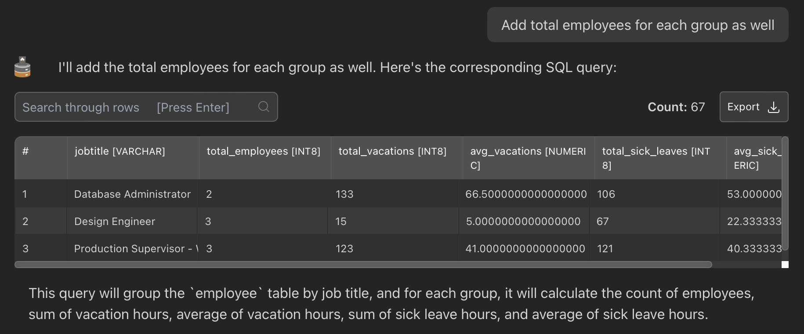
</details>

### Tables

- Select "Tables" from the side bar to view and manage your tables.
  <br /><p align="center"></p>
- Click on a table "Explore" to see its basic information and data.
  <br /><p align="center"></p>
- If you don't have a table present - you can simply add a table using the left most card "Add table" (similar behaviour for collections in NoSQL databases).
  <br /><p align="center">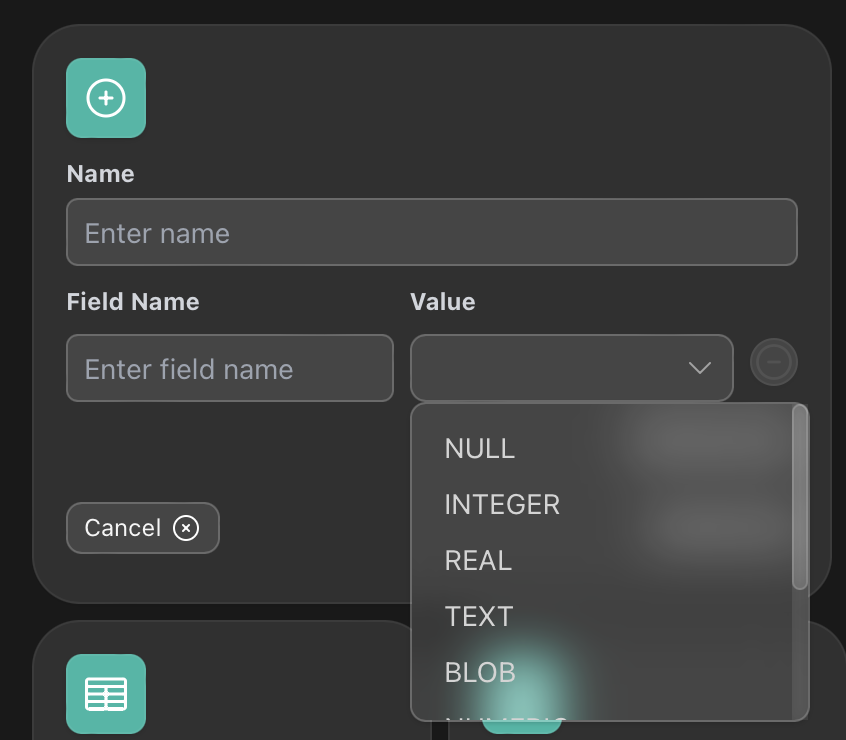</p>
- Inside the table card, hit "Data" to view the table's data (paged to 10 rows by default).
  <br /><p align="center"></p>
- Change the number of rows per page using the configuration on top.
  <br /><p align="center"></p>
- Apply filters using the "+" icon to narrow down your data set. The filters will be dynamically generated based on the database used and fields present.
  <br /><p align="center">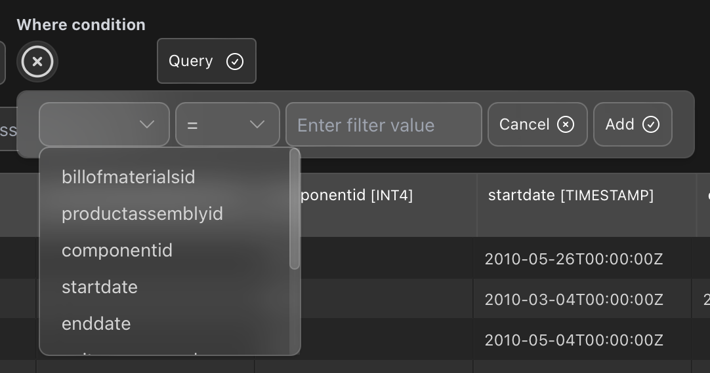</p>
- Export the filtered data to CSV using the export option on the right side.
  <br /><p align="center"></p>
- Use the search feature to quickly find specific data within the table.
  <br /><p align="center"></p>
- Click on a cell and hold to preview the value easily. Currently, WhoDB supports previewing **string**, **JSON**, and **Markdown** values. For example, Markdowns would be shown like this:
 <br /><p align="center"></p>
- Easily edit the content of the cell by simply hitting "Edit" icon. 
<br /><p align="center"></p>
- This should show a popup like below and you can hit "Check" to apply changes. It should reflect in the cell right away if the action is successful! [Note: on the bottom right, "Preview" icon will show for support previews. Click to switch to preview mode]
<br /><p align="center"></p>
- Easily add data to the table using "Add row" on the top right. This will show a smart form that automatically changes based on the table columns. This will allow you to easily add data into any table/collection.
<br /><p align="center">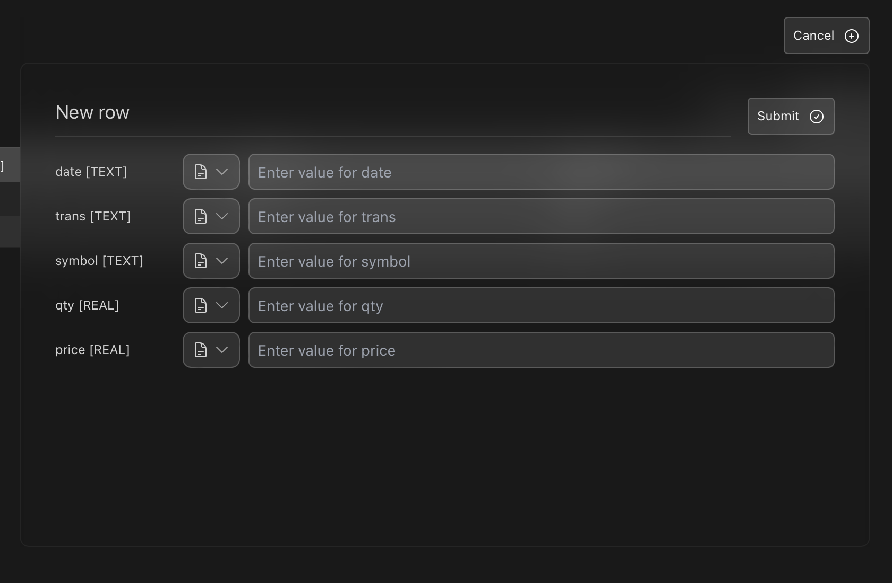</p>

**Note:** Currently, Redis does not support "set" fields to be inline edited.

### Graph Visualization

- Select "Graph" from the side bar to see how all tables are interconnected.
  <br /><p align="center"></p>
- You can directly go to a "Table" directly from the graph
  <br /><p align="center"></p>
  - **Pending Feature**: View the type of connection (e.g., OneToOne, ManyToOne) and constraints (e.g., nullable) on foreign keys.
- You can further export the graph as an image to share the architecture or layout the graph into an auto-layout:
<br /><p align="center">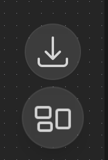</p>


### Scratchpad

- Go to "Scratchpad" in the side bar to perform arbitrary SQL queries directly. This will allow you to create cells like Jupyter notebook to run separate, independent queries on each cell. This should be performant.
  <br /><p align="center">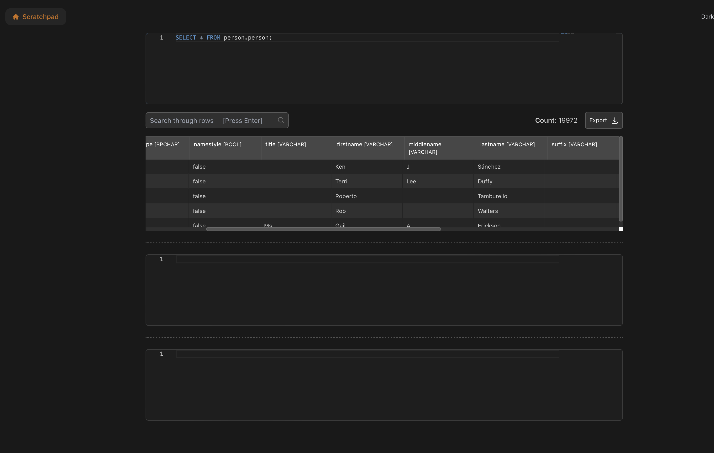</p>

**Note:** Currently, MongoDB & Redis does not support scratchpad.

### Global changes

WhoDB supports to themes currently: Light and Dark mode. To switch between them, go on the top right and toggle the button below:

<br /><p align="center">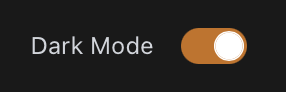</p>

## Pending Features

- **Database Support**: Currently supports PostgreSQL, MySQL, SQLite, MongoDB, Redis, MariaDB, & Elastic Search. Support for other NoSQL databases, graph databases (Neo4JS), etc., is coming soon with the same experience.
- **Detailed Graph Visualization**: Display connection types and constraints on foreign keys.
- **Deleting data**: Deleting rows and tables is under development.
- **Alter tables**: Altering table schema is under development.

## Contributing

Contributions are welcome! Please submit a pull request or open an issue to discuss what you would like to change.
