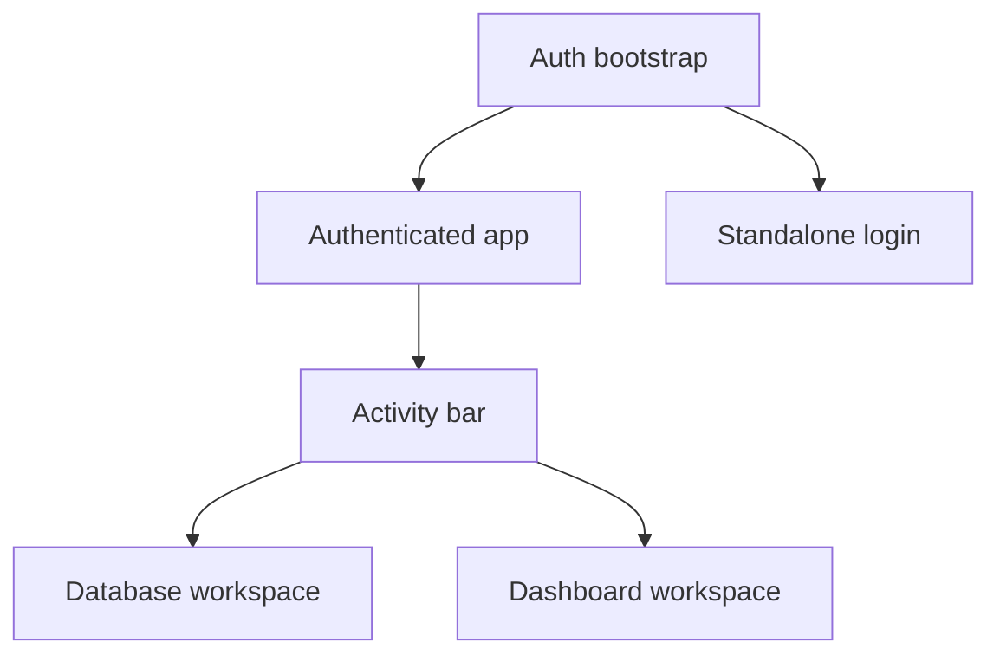

# Information Architecture

DataFlow is a single-page application served from the backend. It does not use browser routes for each workspace surface; navigation is driven by app state, sidebars, and workspace tabs.

## App Shell

## Database Workspace

The database workspace is selected by the `connections` activity tab.

- Activity rail: switches between database and dashboard workspaces.
- Sidebar: lists connections, databases, schemas, tables, views, MongoDB collections, and Redis keys.
- Tab bar: holds query tabs and storage-unit tabs.
- Main tab content:
  - SQL editor and query results.
  - Table detail and Table View.
  - MongoDB Collection Table View and JSON View.
  - Redis key detail view.
  - Modals for create, edit, delete, import, export, and schema actions.

## Dashboard Workspace

The dashboard workspace is selected by the `analysis` activity tab.

- Dashboard sidebar: dashboard selection and dashboard management.
- Dashboard editor: grid canvas for widgets.
- Chart create flow: turns query results into reusable dashboard widgets.
- Widget runtime state: refresh, loading, error, and chart rendering.

## Authentication Surfaces

- Loading state while the auth store initializes.
- Bootstrap error state if session setup fails.
- Standalone login when no persisted session or Sealos bootstrap context exists.
- Disabled standalone login message when server settings disallow manual login.

## Backend Endpoints

- `/api/query`: GraphQL endpoint for queries, mutations, and subscriptions/transports.
- `/api/export`: HTTP export endpoint for CSV, Excel, and NDJSON downloads.
- `/health`: unauthenticated readiness endpoint.
- Static assets: served from the embedded frontend build in production mode.

## Navigation Rules

- Switching between open database workspace tabs does not discard database edits.
- Closing protected tabs, refreshing or closing the browser page, or switching from the database workspace to the dashboard can trigger the workspace tab leave guard.
- Sidebar focus follows the active workspace tab's closest database context and should reveal collapsed ancestors when needed.
- MongoDB wording should preserve the distinction between Collection, Document, Collection Table View, JSON View, and Document JSON Editor.
